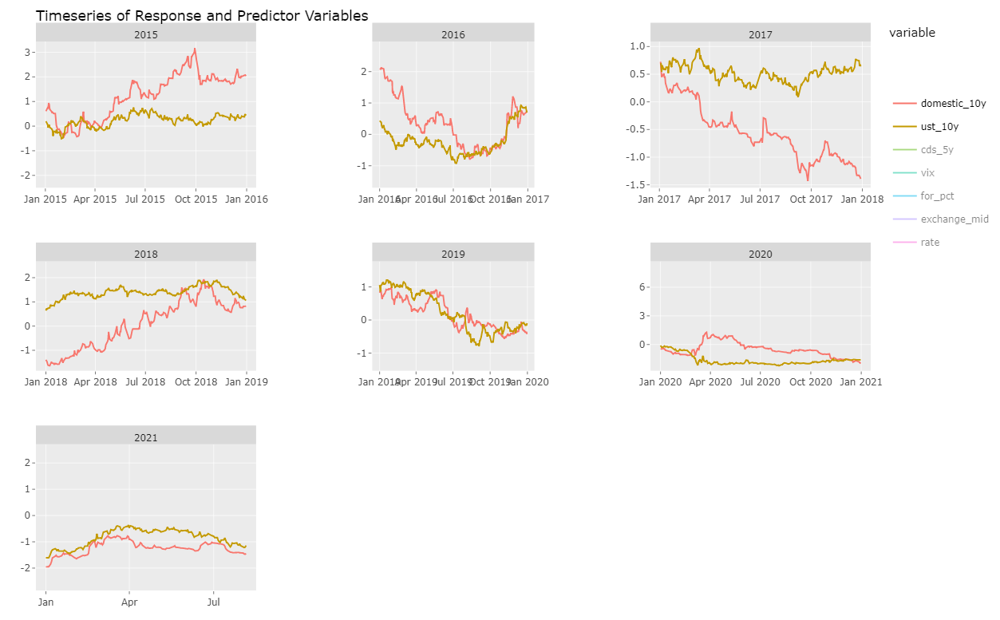
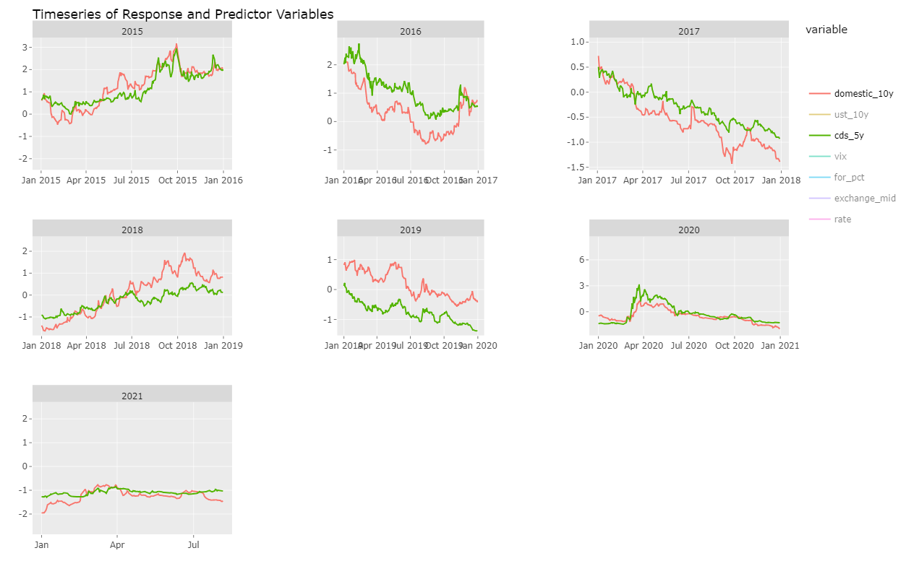
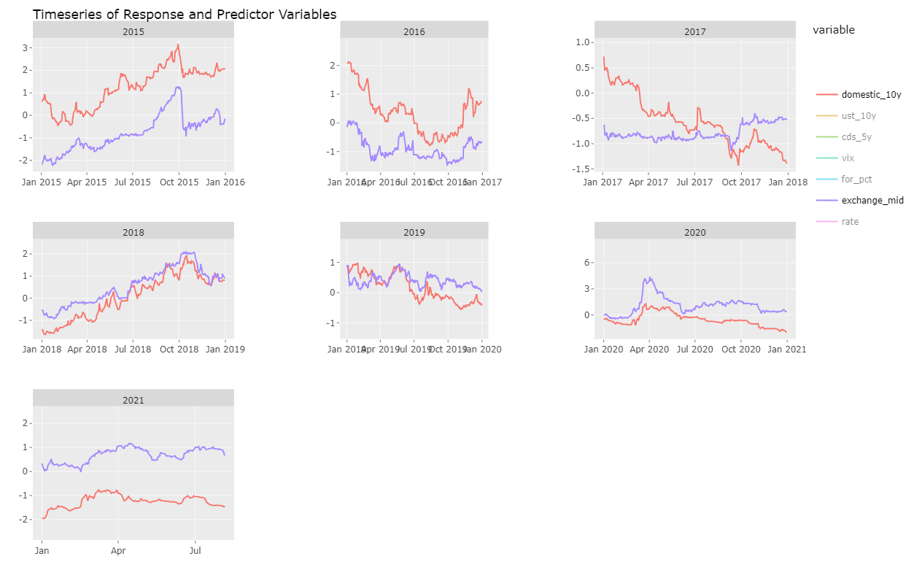
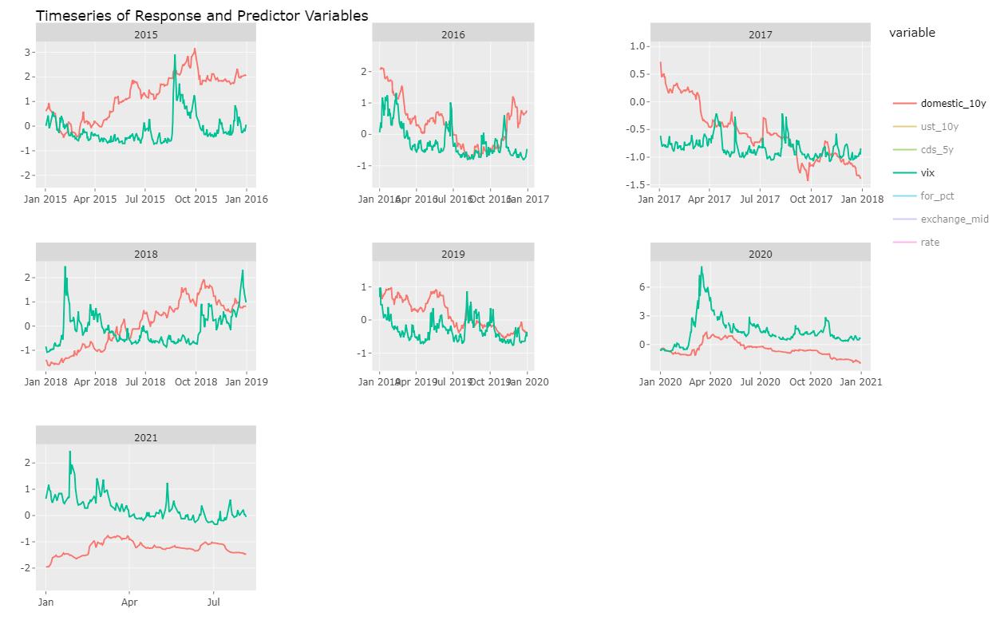
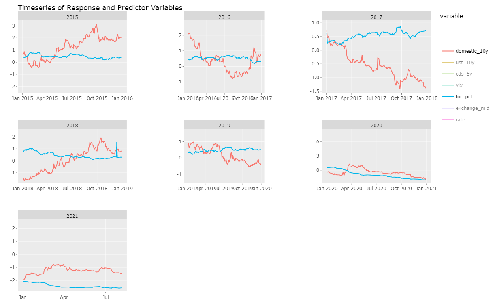
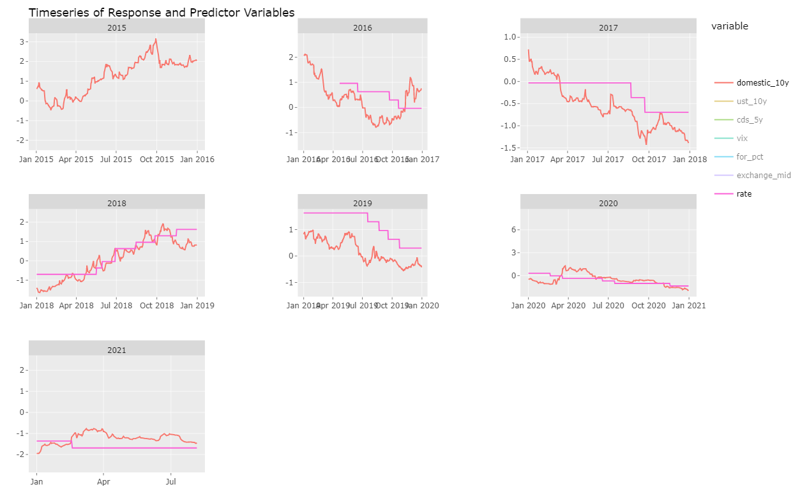

<style>
body {
text-align: justify}
</style>


```{r setup, include=FALSE, warning = FALSE, message = FALSE}
knitr::opts_chunk$set(echo = FALSE)

library(dplyr)
library(ggplot2)
library(tidyverse)
library(tsibble)
library(tsibbletalk)
library(gravitas)
library(readr)
library(readxl)
library(stringr)
library(lubridate)
library(janitor)
library(cleaner)
library(plotly)
library(tsibble)
library(openxlsx)
library(zoo)
library(purrr)
library(sugrrants)
library(GGally)
library(scales)
library(flipTime)
library(caret)
library(patchwork)
library(stargazer)
library(forecast)
library(lvplot)

#read compiled dataset
yield_factors <- readRDS("yield_factors.rds")

```

\newpage

# Introduction

Indonesian government regularly issue Rupiah-denominated sovereign bonds (conventional and sharia bonds) in the primary market to finance the deficit of the national budget. In 2021, the issuance target for the sovereign bonds is around 80-85% of total deficit financing which amounts to IDR1,006 Trillion or equivalent to USD72 Billion ^[Assumed exchange rate for conversion (IDR/USD) = 14,284.00]. As of 2 September 2021, the total outstanding of local currency sovereign bonds (LCB) is IDR4,539 Trillion or equivalent to USD318 billion ^[ibid]. 

The government sells the sovereign bonds through an auction which is conducted every Tuesday. The announcement will be released three days before the auction day (T-3). During a 2-hour auction, investors (both individuals and institutions) can put their bidding in multiple prices through primary dealers, and auction winners will pay their bonds based on their proposed volumes and yields. In addition to the multiple price (competitive) mechanism, the government also offers LCB to several non-competitive participants such as Indonesia Central Bank (Bank Indonesia) and Indonesia Deposit Insurance Corporation (Lembaga Penjamin Simpanan). This non-competitive buying may also be conducted by primary dealers to complement their competitive bidding purchase. Non-competitive buyers will pay their LCB based on weighted average yield (WAY) from the winning competitive bidding.

There are several benchmark series of LCB offered in the auction. These series represent various maturity times. For conventional bonds, tenors of benchmark series in 2021 are ranging from 5, 10, 15, and 20 years. Meanwhile, benchmark tenors of sharia bonds cover 2, 4, 13, and 25 years.  
  
Since 2021, the yield of 10-year LCB has become one of the macroeconomic assumptions in the national budget, replacing treasury bills of tenor 3-month (Surat Perbendaharaan Negara). This replacement is because the yield of 10-year LCB is deemed as having a larger and more significant portion in the nation's cost of borrowing compared to the T-bills. Moreover, the 10-year yield is also reflecting long-term economic development and its movement is commonly used as a sign for predicting country's economic health. 

During a period of 2014-2018, Indonesia is said to have a higher average of 10-year sovereign bonds yield compared to its ASEAN-5 peers (Thailand, Philippines, Malaysia, Vietnam) as well as several other emerging countries with similar credit ratings like Mexico, Columbia, and India [@Muktiyanto2019]. This condition makes Indonesia pays more expensive debt compared to these countries. As corporate and business use the yield for benchmarking when issuing their LCB as well as lending money, the impact of costly debt is also spilled over in the national economy.

Considering the important functions of the 10-year LCB yield in Indonesia's economy, this study will analyze several variables that determine the yield and quantify their impact using the Ordinary Least Squared (OLS) model. This paper will be delivered in several sections. First, we will explain our research's purpose in Section 2. Section 3 will provide background knowledge from prior studies and explanation of the collected data. Section 4 will focus on exploratory data analysis (EDA) by visualizing data to check any interesting features of the variables. Section 5 and section 6 will cover the research methodology and result of analysis subsequently. The Appendix contains additional information.

# Motivation

This paper provides two new values to existing literature. First, it employs an exploratory data analysis (EDA) approach at the beginning of analysis to gain better intuition of each explanatory variable. This approach is quite important especially for capturing particular data characteristics, i.e. non-linearity before we can proceed to a confirmatory step. Disregarding the data characteristic will result in inappropriate data modeling.
Second, this is the first work that empirically studies the impact of primary dealers' behavior on the 10-year LCB yield in Indonesia.  
The purpose of this work will be to provide insights and policy recommendations for the government in reducing LCB yield, particularly by aiming at significant determinant factors, which in turn help to optimize the national's cost of borrowing. 


# Explanation of Collected Data

There are 7 variables used in this paper as explanatory variables to the Indonesia's LCB yield; US Treasury (UST) yield, Credit Default Swap (CDS), foreign ownership (%), central bank's policy rate (policy rate), exchange rate, volatility index (VIX) and a dummy variable of auction/non-auction days as a proxy to primary dealers' trading behavior. The use of these explanatory variables are following numerous studies that have been conducted previously by various authors.  

The UST yield is said by [@Miyajima2015] and [@Muktiyanto2019] to be significantly affecting bonds yield. Miyajima et al. [-@Miyajima2015] conclude that the UST yield, while not a main contributor to the LCB yield in the emerging economies, is to some extent affecting the yield. Muktiyanto et al. whose focus of study is on Indonesia's bonds gives more emphasize on the predictor variable suggesting that the UST yield is not only significant but also has the biggest role in determining the LCB yield of the country. On the contrary, Permanasari et al. [-@Permanasari2021] who also study the same country suggest that the UST yield has no significant effect in determining the LCB yield.

Furthermore, Kim et. al [-@Kim2014] and Muktiyanto et al. [-@Muktiyanto2019] find that Credit Default Swap (CDS) is a significant factor that affecting the yield. The first name, using yield spread decomposition approach, suggest that the CDS as a proxy to default risk has 37% contribution to the spread. Muktiyanto et al. [@Muktiyanto2019] support this finding by suggesting the significant effect of the CDS on the Indonesia's LCB yield.

The effect of foreign ownership on the bonds yield is studied by researchers like Gadanecz et al. [-@Gadanecz2018] who confirm the significance of the variable in LCB market. Another study with similar tone by Dachroui et al. [@Dachraoui2020] who analyze role of capital flight as a driver of sovereign bonds spreads in Latin American countries, conclude that the spreads are positively correlated with the capital flight [-@Dachraoui2020]. 

Our fourth predictor variables used in this study, the policy rate, is inspired by findings from several works in Indonesia conducted by Muktiyanto et al. [-@Muktiyanto2019] and Kurniasih et al. [-@Kurniasih2015] These authors analyze relationship between the predictor with Indonesia's bonds yield. Both studies agree that the policy rate significantly affect the yield in a positive direction.     

Moreover, some works highlight the effect of exchange rate on the bonds yield [@Miyajima2015], [@Gadanecz2018], [@Saenong2020] and [@Permanasari2021]. Miyajima et al. [-@Miyajima2015] suggest crucial effect of the exchange rate on the yield in emerging economies, while Gadanecz et al [@Gadanecz2018] using exchange rate volatility and expected exchange rate as predictor variables also confirm the significant relationship. These two studies are inline with a work by Permanasari et al. [-@Permanasari2021] who study the effect on Indonesia's bonds yield, suggesting significant negative-relationship between the exchange rate and the yield. A slight different conclusion is provided by Saenong et al [@Saenong2020] who argue that the effect on the Indonesia's bonds yield only significant in the short run but find to be insignificant in the long run.

Meanwhile, relationship between our sixth predictor-the VIX and the bonds yield is said to be significant by several researchers like [@Miyajima2015], [@Izadi2018], and [@Dachraoui2020]. Miyajima find the significant relationship in several emerging market being observed, while Izadi et al. [@Izadi2018] also find the similar effect in all 24 developed countries in
North America, Europe and Pacific Rim regions. In addition, Dachraoui [-@Dachraoui2020] confirm the significant effect in Latin America.

Other researches like Tchuindjo et al.[-@Tchuindjo2015], Endo [-@Endo2020], Nyborg et al. [-@Nyborg2004], Mercer et al. [-@Mercer2013], and Ferrari et al. [-@Ferrari2018] took different angle by looking at primary dealers system and its impact on bonds yield. Endo [-@Endo2020] study role of primary dealers in low income economies, while Ferrari et al. [-@Ferrari2018] focus on primary dealers' funding constraints on sovereign bonds yield. Nyborg et al. [-@Nyborg2004], Mercer et al. [-@Mercer2013] and Tchuindjo [-@Tchuindjo2015] concern on primary dealers trading behavior in US Treasury auction. The last name also provide several mathematical models to estimate the impact of primary dealers' strategic behavior in the auction [-@Tchuindjo2015].

For the purpose of our study, we will use 10-year US Treasury (UST) yield, 5-year Indonesia's Credit Default Swap (CDS), foreign ownership in Indonesia's 10-year bonds(%), Bank Indonesia's policy rate, exchange rate (IDR/USD), Indonesia's volatility index (VIX) as well as a dummy variable of Indonesian government auction days as a proxy of Indonesia's primary dealers' behavior. Our response variable is the 10-year Indonesia's LCB yield. All variables are collected as time-series data covering period from 2 January 2015 up to 5 August 2021 and can be described as follow: 

<!-- Gadanecz et al. [-@Gadanecz2018] plays important role as stabilizing force of exchange rate volatility.  -->

## 10-year LCB Yield  

Yield is expected return demanded by investors as exchange of risks being borne. The 10-year yield data used in this study is a Indonesia's generic yield retrieved from Bloomberg platform using ticker code "GRR" (global summary of government bill, note, and benchmark bond rates for individual countries). 

```{r}
# saveRDS(yield_ts_fix, file = "yield_ts.rds")
yield_ts <- readRDS("yield_ts.rds") %>% arrange(date)

####scaling variables
yieldts_scale <- yield_ts %>% as_tibble() %>% 
  mutate(for_pct = foreign/tot_ownership) %>% 
  select_if(is.numeric) %>% 
  scale()
yieldts_scale <- cbind(as_tibble(yield_ts$date), yieldts_scale) %>% rename(date = value)

```

```{r warning = FALSE, message=FALSE}

## search harmony
harmony <- harmony(yield_ts)

# semester yield 10y
# 2015
dom2015 <- yield_ts %>% 
  select(date, domestic_10y, auction_day) %>% 
  filter(year(date) == 2015) %>% 
  prob_plot(
     gran1 = "quarter_semester",
     gran2 = "week_month",
     response = "domestic_10y",
     plot_type = "boxplot") +
   scale_y_sqrt() + scale_x_discrete(breaks = seq(0, 23, 3))+ggtitle("2015")
# 2016
dom2016 <- yield_ts %>% 
  select(date, domestic_10y, auction_day) %>% 
  filter(year(date) == 2016) %>% 
  prob_plot(
     gran1 = "quarter_semester",
     gran2 = "week_month",
     response = "domestic_10y",
     plot_type = "boxplot") +
   scale_y_sqrt() + scale_x_discrete(breaks = seq(0, 23, 3))+ggtitle("2016")
# 2017
dom2017 <- yield_ts %>% 
  select(date, domestic_10y, auction_day) %>% 
  filter(year(date) == 2017) %>% 
  prob_plot(
     gran1 = "quarter_semester",
     gran2 = "week_month",
     response = "domestic_10y",
     plot_type = "boxplot") +
   scale_y_sqrt() + scale_x_discrete(breaks = seq(0, 23, 3))+ggtitle("2017")
# 2018
dom2018 <- yield_ts %>% 
  select(date, domestic_10y, auction_day) %>% 
  filter(year(date) == 2018) %>% 
  prob_plot(
     gran1 = "quarter_semester",
     gran2 = "week_month",
     response = "domestic_10y",
     plot_type = "boxplot") +
   scale_y_sqrt() + scale_x_discrete(breaks = seq(0, 23, 3))+ggtitle("2018")

# 2019
dom2019 <- yield_ts %>% 
  select(date, domestic_10y, auction_day) %>% 
  filter(year(date) == 2019) %>% 
  prob_plot(
     gran1 = "quarter_semester",
     gran2 = "week_month",
     response = "domestic_10y",
     plot_type = "boxplot") +
   scale_y_sqrt() + scale_x_discrete(breaks = seq(0, 23, 3))+ggtitle("2019")

# 2020
dom2020 <- yield_ts %>% 
  select(date, domestic_10y, auction_day) %>% 
  filter(year(date) == 2020) %>% 
  prob_plot(
     gran1 = "quarter_semester",
     gran2 = "week_month",
     response = "domestic_10y",
     plot_type = "boxplot") +
   scale_y_sqrt() + scale_x_discrete(breaks = seq(0, 23, 3))+ggtitle("2020")

# 2021
dom2021 <- yield_ts %>% 
  select(date, domestic_10y, auction_day) %>% 
  filter(year(date) == 2021) %>% 
  prob_plot(
     gran1 = "quarter_semester",
     gran2 = "week_month",
     response = "domestic_10y",
     plot_type = "boxplot") +
   scale_y_sqrt() + scale_x_discrete(breaks = seq(0, 23, 3))+ggtitle("2021")

dom2015+dom2016+dom2017+dom2018+dom2019+dom2020+dom2021+
  plot_annotation(title = "10y-LCB yield by Semester")
            
## Result:
## Yield volatility is intense (shown by long interquartile) in semester 2, distinct to other years (exc 2019, 2020).
#2017 and 2019 have higher median in semester 1, others have higher median in sem 2.
```

```{r warning = FALSE, message = FALSE}

# create multivariate lines of timeseries
# gatherscale <- yieldts_scale %>% 
#   select(date, domestic_10y, ust_10y, cds_5y, vix, exchange_mid, for_pct, rate) %>% 
#   gather(key = "variable", value = "value", -date)
# 
# gatherscale$variable <- factor(gatherscale$variable, levels = c("domestic_10y", "ust_10y", "cds_5y", "vix", "for_pct", "exchange_mid", "rate"))
# 
# gatherscale %>% 
#   ggplot(aes(x = date, y = value))+
#   geom_line(aes(color = variable))+
#   facet_wrap(~ year(date), scale = "free")+
#   ggtitle("Timeseries of Response and Predictor Variables")+
#   theme(legend.position = "bottom") 
# 
# ggplotly()

```

```{r out.width= "50%"}

```

```{r out.width= "50%"}

```

```{r out.width= "50%"}

```

```{r out.width= "50%"}

```

```{r out.width= "50%"}

```

```{r out.width= "50%"}

```


```{r message = FALSE, warning = FALSE}

### scaled with lag 1
# yieldts_scalelag <- yieldts_scale %>% 
#   mutate(domestic_10y = lag(domestic_10y))
#   
# yield_lag <- yieldts_scale %>% 
#   select(date, domestic_10y) %>% 
#   slice(1:nrow(yieldts_scale)-1)
# 
# yieldts_scalelag <- cbind(yield_lag, yieldts_scalelag)
# gatherscale %>% 
#   ggplot(aes(x = date, y = lag(value)))+
#   geom_line(aes(color = variable))+
#   facet_wrap(~ year(date), scale = "free")+
#   ggtitle("Timeseries of Response and Predictor Variables")+
#   theme(legend.position = "bottom")
# ggplotly()

yieldts_scale %>% 
  ggplot(aes(x = date)) +
  geom_line(aes(y = domestic_10y), alpha = 0.8)+
  geom_line(aes(y = lag(domestic_10y, 1)), color = "red", alpha = 0.5)+
  facet_wrap(~ year(date), scale = "free")+
  ggtitle("Timeseries of Lagged-10y LCB Yield and 10y LCB Yield")

## lagged domestic 10y vs FX
fxlag1 <- yieldts_scale %>% 
  filter(year(date) == 2015) %>% 
  ggplot(aes(x = date)) +
  geom_line(aes(y = exchange_mid), alpha = 0.8)+
  geom_line(aes(y = lag(domestic_10y, 1)), color = "red", alpha = 0.5)+
  ggtitle("2015")
  
fxlag2 <- yieldts_scale %>% 
  filter(year(date) == 2016) %>% 
  ggplot(aes(x = date)) +
  geom_line(aes(y = exchange_mid), alpha = 0.8)+
  geom_line(aes(y = lag(domestic_10y, 1)), color = "red", alpha = 0.5)+
  ggtitle("2016")

fxlag3 <- yieldts_scale %>% 
  filter(year(date) == 2017) %>% 
  ggplot(aes(x = date)) +
  geom_line(aes(y = exchange_mid), alpha = 0.8)+
  geom_line(aes(y = lag(domestic_10y, 1)), color = "red", alpha = 0.5)+
  ggtitle("2017")

fxlag4 <- yieldts_scale %>% 
  filter(year(date) == 2018) %>% 
  ggplot(aes(x = date)) +
  geom_line(aes(y = exchange_mid), alpha = 0.8)+
  geom_line(aes(y = lag(domestic_10y, 1)), color = "red", alpha = 0.5)+
  ggtitle("2018")

fxlag5 <- yieldts_scale %>% 
  filter(year(date) == 2019) %>% 
  ggplot(aes(x = date)) +
  geom_line(aes(y = exchange_mid), alpha = 0.8)+
  geom_line(aes(y = lag(domestic_10y, 1)), color = "red", alpha = 0.5)+
  ggtitle("2019")

fxlag6 <- yieldts_scale %>% 
  filter(year(date) == 2020) %>% 
  ggplot(aes(x = date)) +
  geom_line(aes(y = exchange_mid), alpha = 0.8)+
  geom_line(aes(y = lag(domestic_10y, 1)), color = "red", alpha = 0.5)+
  ggtitle("2020")

fxlag7 <- yieldts_scale %>% 
  filter(year(date) == 2021) %>% 
  ggplot(aes(x = date)) +
  geom_line(aes(y = exchange_mid), alpha = 0.8)+
  geom_line(aes(y = lag(domestic_10y, 1)), color = "red", alpha = 0.5)+
  ggtitle("2021")

(fxlag1+fxlag2+fxlag3 + fxlag4+fxlag5 + fxlag6+ fxlag7) + plot_annotation(title = "Timeseries Lagged-LCB Yield and Exchange Rate")
  
## lagged domestic 10y vs ust
ustlag1 <- yieldts_scale %>% 
  filter(year(date) == 2015) %>% 
  ggplot(aes(x = date)) +
  geom_line(aes(y = ust_10y), alpha = 0.8)+
  geom_line(aes(y = lag(domestic_10y, 1)), color = "red", alpha = 0.5)+
  ggtitle("2015")
  
ustlag2 <- yieldts_scale %>% 
  filter(year(date) == 2016) %>% 
  ggplot(aes(x = date)) +
  geom_line(aes(y = ust_10y), alpha = 0.8)+
  geom_line(aes(y = lag(domestic_10y, 1)), color = "red", alpha = 0.5)+
  ggtitle("2016")

ustlag3 <- yieldts_scale %>% 
  filter(year(date) == 2017) %>% 
  ggplot(aes(x = date)) +
  geom_line(aes(y = ust_10y), alpha = 0.8)+
  geom_line(aes(y = lag(domestic_10y, 1)), color = "red", alpha = 0.5)+
  ggtitle("2017")

ustlag4 <- yieldts_scale %>% 
  filter(year(date) == 2018) %>% 
  ggplot(aes(x = date)) +
  geom_line(aes(y = ust_10y), alpha = 0.8)+
  geom_line(aes(y = lag(domestic_10y, 1)), color = "red", alpha = 0.5)+
  ggtitle("2018")

ustlag5 <- yieldts_scale %>% 
  filter(year(date) == 2019) %>% 
  ggplot(aes(x = date)) +
  geom_line(aes(y = ust_10y), alpha = 0.8)+
  geom_line(aes(y = lag(domestic_10y, 1)), color = "red", alpha = 0.5)+
  ggtitle("2019")

ustlag6 <- yieldts_scale %>% 
  filter(year(date) == 2020) %>% 
  ggplot(aes(x = date)) +
  geom_line(aes(y = ust_10y), alpha = 0.8)+
  geom_line(aes(y = lag(domestic_10y, 1)), color = "red", alpha = 0.5)+
  ggtitle("2020")

ustlag7 <- yieldts_scale %>% 
  filter(year(date) == 2021) %>% 
  ggplot(aes(x = date)) +
  geom_line(aes(y = ust_10y), alpha = 0.8)+
  geom_line(aes(y = lag(domestic_10y, 1)), color = "red", alpha = 0.5)+
  ggtitle("2021")

(ustlag1+ustlag2+ustlag3 + ustlag4+ustlag5 + ustlag6+ ustlag7) + plot_annotation(title = "Timeseries Lagged-LCB Yield and 10y-UST")

## lagged domestic 10y vs cds
cdslag1 <- yieldts_scale %>% 
  filter(year(date) == 2015) %>% 
  ggplot(aes(x = date)) +
  geom_line(aes(y = cds_5y), alpha = 0.8)+
  geom_line(aes(y = lag(domestic_10y, 1)), color = "red", alpha = 0.5)+
  ggtitle("2015")
  
cdslag2 <- yieldts_scale %>% 
  filter(year(date) == 2016) %>% 
  ggplot(aes(x = date)) +
  geom_line(aes(y = cds_5y), alpha = 0.8)+
  geom_line(aes(y = lag(domestic_10y, 1)), color = "red", alpha = 0.5)+
  ggtitle("2016")

cdslag3 <- yieldts_scale %>% 
  filter(year(date) == 2017) %>% 
  ggplot(aes(x = date)) +
  geom_line(aes(y = cds_5y), alpha = 0.8)+
  geom_line(aes(y = lag(domestic_10y, 1)), color = "red", alpha = 0.5)+
  ggtitle("2017")

cdslag4 <- yieldts_scale %>% 
  filter(year(date) == 2018) %>% 
  ggplot(aes(x = date)) +
  geom_line(aes(y = cds_5y), alpha = 0.8)+
  geom_line(aes(y = lag(domestic_10y, 1)), color = "red", alpha = 0.5)+
  ggtitle("2018")

cdslag5 <- yieldts_scale %>% 
  filter(year(date) == 2019) %>% 
  ggplot(aes(x = date)) +
  geom_line(aes(y = cds_5y), alpha = 0.8)+
  geom_line(aes(y = lag(domestic_10y, 1)), color = "red", alpha = 0.5)+
  ggtitle("2019")

cdslag6 <- yieldts_scale %>% 
  filter(year(date) == 2020) %>% 
  ggplot(aes(x = date)) +
  geom_line(aes(y = cds_5y), alpha = 0.8)+
  geom_line(aes(y = lag(domestic_10y, 1)), color = "red", alpha = 0.5)+
  ggtitle("2020")

cdslag7 <- yieldts_scale %>% 
  filter(year(date) == 2021) %>% 
  ggplot(aes(x = date)) +
  geom_line(aes(y = cds_5y), alpha = 0.8)+
  geom_line(aes(y = lag(domestic_10y, 1)), color = "red", alpha = 0.5)+
  ggtitle("2021")

(cdslag1+cdslag2+cdslag3 + cdslag4+cdslag5 + cdslag6+ cdslag7) + plot_annotation(title = "Timeseries Lagged-LCB Yield and 5y-CDS")

## lagged domestic 10y vs VIX
vixlag1 <- yieldts_scale %>% 
  filter(year(date) == 2015) %>% 
  ggplot(aes(x = date)) +
  geom_line(aes(y = vix), alpha = 0.8)+
  geom_line(aes(y = lag(domestic_10y, 1)), color = "red", alpha = 0.5)+
  ggtitle("2015")
  
vixlag2 <- yieldts_scale %>% 
  filter(year(date) == 2016) %>% 
  ggplot(aes(x = date)) +
  geom_line(aes(y = vix), alpha = 0.8)+
  geom_line(aes(y = lag(domestic_10y, 1)), color = "red", alpha = 0.5)+
  ggtitle("2016")

vixlag3 <- yieldts_scale %>% 
  filter(year(date) == 2017) %>% 
  ggplot(aes(x = date)) +
  geom_line(aes(y = vix), alpha = 0.8)+
  geom_line(aes(y = lag(domestic_10y, 1)), color = "red", alpha = 0.5)+
  ggtitle("2017")

vixlag4 <- yieldts_scale %>% 
  filter(year(date) == 2018) %>% 
  ggplot(aes(x = date)) +
  geom_line(aes(y = vix), alpha = 0.8)+
  geom_line(aes(y = lag(domestic_10y, 1)), color = "red", alpha = 0.5)+
  ggtitle("2018")

vixlag5 <- yieldts_scale %>% 
  filter(year(date) == 2019) %>% 
  ggplot(aes(x = date)) +
  geom_line(aes(y = vix), alpha = 0.8)+
  geom_line(aes(y = lag(domestic_10y, 1)), color = "red", alpha = 0.5)+
  ggtitle("2019")

vixlag6 <- yieldts_scale %>% 
  filter(year(date) == 2020) %>% 
  ggplot(aes(x = date)) +
  geom_line(aes(y = vix), alpha = 0.8)+
  geom_line(aes(y = lag(domestic_10y, 1)), color = "red", alpha = 0.5)+
  ggtitle("2020")

vixlag7 <- yieldts_scale %>% 
  filter(year(date) == 2021) %>% 
  ggplot(aes(x = date)) +
  geom_line(aes(y = vix), alpha = 0.8)+
  geom_line(aes(y = lag(domestic_10y, 1)), color = "red", alpha = 0.5)+
  ggtitle("2021")

(vixlag1+vixlag2+vixlag3 + vixlag4+vixlag5 + vixlag6+ vixlag7) + plot_annotation(title = "Timeseries Lagged-LCB Yield and VIX")


## lagged domestic 10y vs Foreign
forlag1 <- yieldts_scale %>% 
  filter(year(date) == 2015) %>% 
  ggplot(aes(x = date)) +
  geom_line(aes(y = for_pct), alpha = 0.8)+
  geom_line(aes(y = lag(domestic_10y, 1)), color = "red", alpha = 0.5)+
  ggtitle("2015")
  
forlag2 <- yieldts_scale %>% 
  filter(year(date) == 2016) %>% 
  ggplot(aes(x = date)) +
  geom_line(aes(y = for_pct), alpha = 0.8)+
  geom_line(aes(y = lag(domestic_10y, 1)), color = "red", alpha = 0.5)+
  ggtitle("2016")

forlag3 <- yieldts_scale %>% 
  filter(year(date) == 2017) %>% 
  ggplot(aes(x = date)) +
  geom_line(aes(y = for_pct), alpha = 0.8)+
  geom_line(aes(y = lag(domestic_10y, 1)), color = "red", alpha = 0.5)+
  ggtitle("2017")

forlag4 <- yieldts_scale %>% 
  filter(year(date) == 2018) %>% 
  ggplot(aes(x = date)) +
  geom_line(aes(y = for_pct), alpha = 0.8)+
  geom_line(aes(y = lag(domestic_10y, 1)), color = "red", alpha = 0.5)+
  ggtitle("2018")

forlag5 <- yieldts_scale %>% 
  filter(year(date) == 2019) %>% 
  ggplot(aes(x = date)) +
  geom_line(aes(y = for_pct), alpha = 0.8)+
  geom_line(aes(y = lag(domestic_10y, 1)), color = "red", alpha = 0.5)+
  ggtitle("2019")

forlag6 <- yieldts_scale %>% 
  filter(year(date) == 2020) %>% 
  ggplot(aes(x = date)) +
  geom_line(aes(y = for_pct), alpha = 0.8)+
  geom_line(aes(y = lag(domestic_10y, 1)), color = "red", alpha = 0.5)+
  ggtitle("2020")

forlag7 <- yieldts_scale %>% 
  filter(year(date) == 2021) %>% 
  ggplot(aes(x = date)) +
  geom_line(aes(y = for_pct), alpha = 0.8)+
  geom_line(aes(y = lag(domestic_10y, 1)), color = "red", alpha = 0.5)+
  ggtitle("2021")

(forlag1+forlag2+forlag3 + forlag4+forlag5 + forlag6+ forlag7) + plot_annotation(title = "Timeseries Lagged-LCB Yield and Foreign Ownership")


## lagged domestic 10y vs Policy Rate
ratelag1 <- yieldts_scale %>% 
  filter(year(date) == 2015) %>% 
  ggplot(aes(x = date)) +
  geom_line(aes(y = rate), alpha = 0.8)+
  geom_line(aes(y = lag(domestic_10y, 1)), color = "red", alpha = 0.5)+
  ggtitle("2015")
  
ratelag2 <- yieldts_scale %>% 
  filter(year(date) == 2016) %>% 
  ggplot(aes(x = date)) +
  geom_line(aes(y = rate), alpha = 0.8)+
  geom_line(aes(y = lag(domestic_10y, 1)), color = "red", alpha = 0.5)+
  ggtitle("2016")

ratelag3 <- yieldts_scale %>% 
  filter(year(date) == 2017) %>% 
  ggplot(aes(x = date)) +
  geom_line(aes(y = rate), alpha = 0.8)+
  geom_line(aes(y = lag(domestic_10y, 1)), color = "red", alpha = 0.5)+
  ggtitle("2017")

ratelag4 <- yieldts_scale %>% 
  filter(year(date) == 2018) %>% 
  ggplot(aes(x = date)) +
  geom_line(aes(y = rate), alpha = 0.8)+
  geom_line(aes(y = lag(domestic_10y, 1)), color = "red", alpha = 0.5)+
  ggtitle("2018")

ratelag5 <- yieldts_scale %>% 
  filter(year(date) == 2019) %>% 
  ggplot(aes(x = date)) +
  geom_line(aes(y = rate), alpha = 0.8)+
  geom_line(aes(y = lag(domestic_10y, 1)), color = "red", alpha = 0.5)+
  ggtitle("2019")

ratelag6 <- yieldts_scale %>% 
  filter(year(date) == 2020) %>% 
  ggplot(aes(x = date)) +
  geom_line(aes(y = rate), alpha = 0.8)+
  geom_line(aes(y = lag(domestic_10y, 1)), color = "red", alpha = 0.5)+
  ggtitle("2020")

ratelag7 <- yieldts_scale %>% 
  filter(year(date) == 2021) %>% 
  ggplot(aes(x = date)) +
  geom_line(aes(y = rate), alpha = 0.8)+
  geom_line(aes(y = lag(domestic_10y, 1)), color = "red", alpha = 0.5)+
  ggtitle("2021")

(ratelag1+ratelag2+ratelag3 + ratelag4+ratelag5 + ratelag6+ ratelag7) + plot_annotation(title = "Timeseries Lagged-LCB Yield and Policy Rate")

```

Furthermore, as yield is associated with risks, we will group our explanatory variables based on several relevant risk categories.

## External Risk  

### 10-year US Treasury Yield

The United States of America government's bonds (UST bonds) is generally used as a benchmark for other countries' sovereign bonds. The bonds is considered as the safest instrument hence issuers from other countries will give extra premium over the UST bonds yield in order to compensate additional risks taken by investors for purchasing non-UST bonds.
The UST yield data used in this study is sourced from Bloomberg with the same ticker code "GRR" for the 10-year maturity government bonds of the United State of America.  

```{r}
yield_ts <- yield_factors %>% 
  mutate(date = ymd(date)) %>% 
  as_tsibble(key = domestic_10y, index = date)

 yield_ts %>%
  mutate(foreign_prop = foreign/tot_ownership) %>%
  mutate(cum_foreign = cumsum(foreign_prop)) %>%
  ggplot(aes(x = date, y = ust_10y))+geom_line()
```

```{r message = FALSE, warning = FALSE}
# gravitas window probs
# semester ust 10y
# 2015
ust2015 <- yield_ts %>% 
  select(date, ust_10y, auction_day) %>% 
  filter(year(date) == 2015) %>% 
  prob_plot(
     gran1 = "quarter_semester",
     gran2 = "week_month",
     response = "domestic_10y",
     plot_type = "boxplot") +
   scale_y_sqrt() + scale_x_discrete(breaks = seq(0, 23, 3))+ggtitle("2015")
# 2016
ust2016 <- yield_ts %>% 
  select(date, ust_10y, auction_day) %>% 
  filter(year(date) == 2016) %>% 
  prob_plot(
     gran1 = "quarter_semester",
     gran2 = "week_month",
     response = "ust_10y",
     plot_type = "boxplot") +
   scale_y_sqrt() + scale_x_discrete(breaks = seq(0, 23, 3))+ggtitle("2016")
# 2017
ust2017 <- yield_ts %>% 
  select(date, ust_10y, auction_day) %>% 
  filter(year(date) == 2017) %>% 
  prob_plot(
     gran1 = "quarter_semester",
     gran2 = "week_month",
     response = "ust_10y",
     plot_type = "boxplot") +
   scale_y_sqrt() + scale_x_discrete(breaks = seq(0, 23, 3))+ggtitle("2017")
# 2018
ust2018 <- yield_ts %>% 
  select(date, ust_10y, auction_day) %>% 
  filter(year(date) == 2018) %>% 
  prob_plot(
     gran1 = "quarter_semester",
     gran2 = "week_month",
     response = "ust_10y",
     plot_type = "boxplot") +
   scale_y_sqrt() + scale_x_discrete(breaks = seq(0, 23, 3))+ggtitle("2018")

# 2019
ust2019 <- yield_ts %>% 
  select(date, ust_10y, auction_day) %>% 
  filter(year(date) == 2019) %>% 
  prob_plot(
     gran1 = "quarter_semester",
     gran2 = "week_month",
     response = "ust_10y",
     plot_type = "boxplot") +
   scale_y_sqrt() + scale_x_discrete(breaks = seq(0, 23, 3))+ggtitle("2019")

# 2020
ust2020 <- yield_ts %>% 
  select(date, ust_10y, auction_day) %>% 
  filter(year(date) == 2020) %>% 
  prob_plot(
     gran1 = "quarter_semester",
     gran2 = "week_month",
     response = "ust_10y",
     plot_type = "boxplot") +
   scale_y_sqrt() + scale_x_discrete(breaks = seq(0, 23, 3))+ggtitle("2020")

# 2021
ust2021 <- yield_ts %>% 
  select(date, ust_10y, auction_day) %>% 
  filter(year(date) == 2021) %>% 
  prob_plot(
     gran1 = "quarter_semester",
     gran2 = "week_month",
     response = "ust_10y",
     plot_type = "boxplot") +
   scale_y_sqrt() + scale_x_discrete(breaks = seq(0, 23, 3))+ggtitle("2021")

ust2015+ust2016+ust2017+ust2018+ust2019+ust2020+ust2021+
  plot_annotation(title = "UST 10y yield by Semester")
```


```{r}
yield_factors %>% 
  mutate(week_year = yearweek(date), year = year(date), foreign_chg = foreign/tot_ownership) %>% 
  ggplot(aes(x = ust_10y, y = domestic_10y)) + 
  geom_point(alpha = 0.3)+facet_wrap(~ year, scale = "free")+theme_light()+ylab("10y Yield")+xlab("10y UST")
```

### Foreign Ownership

As per 29 July 2021, foreign investors are holding IDR965 Trillions or 22.5% of total bonds ownership.

```{r}

yield_foreign <- yield_ts %>% 
  mutate(foreign_prop = foreign/tot_ownership) %>%
  mutate(cum_foreign = cumsum(foreign_prop))
yield_foreign %>% 
  ggplot(aes(x = date, y = foreign))+geom_line()

# library(feasts)
# 
# tourism_shared <- tourism %>%
#   as_shared_tsibble(spec = (State / Region) * Purpose)
# 
# yield_shared <- yield_ts %>% mutate(auction_day = factor(auction_day)) %>% 
#   as_shared_tsibble(spec = domestic_10y)
# 
# p0 <- plotly_key_tree(tourism_shared, height = 900, width = 600)
# p0 <- plotly_key_tree(yield_shared, height = 900, width = 600)


# tourism_feat <- tourism_shared %>%
#   features(Trips, feat_stl)
# 
# yield_feat <- yield_shared %>%
#   features(domestic_10y, feat_stl)
# 
# 
# p1 <- tourism_shared %>%
#   ggplot(aes(x = Quarter, y = Trips)) +
#   geom_line(aes(group = Region), alpha = 0.5) +
#   facet_wrap(~ Purpose, scales = "free_y")
# 
# p1 <- yield_shared %>% 
#   ggplot(aes(x = date, y = domestic_10y))+
#   geom_line(alpha = 0.5) +
#   facet_wrap(~ auction_day, scales = "free_y", nrow = 2)

# yield_ts %>% 
#   ggplot(aes(x = date))+
#   geom_line(aes(y = domestic_10y), alpha = 0.5) +
#   geom_line(aes(y = ust_10y), alpha = 0.5) +
#   facet_wrap(~ year(date), scales = "free", nrow = 7)
# 
# p2 <- tourism_feat %>%
#   ggplot(aes(x = trend_strength, y = seasonal_strength_year)) +
#   geom_point(aes(group = Region))
# 
# library(plotly)
# subplot(p0,
#   subplot(
#     ggplotly(p1, tooltip = "Region", width = 900),
#     ggplotly(p2, tooltip = "Region", width = 900),
#     nrows = 2),
#   widths = c(.4, .6)) %>%
#   highlight(dynamic = TRUE)


```


```{r message = FALSE, warning = FALSE}
# semester 
# 2015
for2015 <- yield_ts %>% 
  mutate(foreign_pct = foreign/tot_ownership) %>% 
  select(date, foreign_pct, auction_day) %>% 
  filter(year(date) == 2015) %>% 
  prob_plot(
     gran1 = "quarter_semester",
     gran2 = "week_month",
     response = "foreign_pct",
     plot_type = "boxplot") +
   scale_y_sqrt() + scale_x_discrete(breaks = seq(0, 23, 3))+ggtitle("2015")
# 2016
for2016 <- yield_ts %>% 
  mutate(foreign_pct = foreign/tot_ownership) %>% 
  select(date, foreign_pct, auction_day) %>% 
  filter(year(date) == 2016) %>% 
  prob_plot(
     gran1 = "quarter_semester",
     gran2 = "week_month",
     response = "foreign_pct",
     plot_type = "boxplot") +
   scale_y_sqrt() + scale_x_discrete(breaks = seq(0, 23, 3))+ggtitle("2016")
# 2017
for2017 <- yield_ts %>% 
 mutate(foreign_pct = foreign/tot_ownership) %>% 
  select(date, foreign_pct, auction_day) %>%  
  filter(year(date) == 2017) %>% 
  prob_plot(
     gran1 = "quarter_semester",
     gran2 = "week_month",
     response = "foreign_pct",
     plot_type = "boxplot") +
   scale_y_sqrt() + scale_x_discrete(breaks = seq(0, 23, 3))+ggtitle("2017")
# 2018
for2018 <- yield_ts %>% 
  mutate(foreign_pct = foreign/tot_ownership) %>% 
  select(date, foreign_pct, auction_day) %>% 
  filter(year(date) == 2018) %>% 
  prob_plot(
     gran1 = "quarter_semester",
     gran2 = "week_month",
     response = "foreign_pct",
     plot_type = "boxplot") +
   scale_y_sqrt() + scale_x_discrete(breaks = seq(0, 23, 3))+ggtitle("2018")

# 2019
for2019 <- yield_ts %>% 
 mutate(foreign_pct = foreign/tot_ownership) %>% 
  select(date, foreign_pct, auction_day) %>% 
  filter(year(date) == 2019) %>% 
  prob_plot(
     gran1 = "quarter_semester",
     gran2 = "week_month",
     response = "foreign_pct",
     plot_type = "boxplot") +
   scale_y_sqrt() + scale_x_discrete(breaks = seq(0, 23, 3))+ggtitle("2019")

# 2020
for2020 <- yield_ts %>% 
  mutate(foreign_pct = foreign/tot_ownership) %>% 
  select(date, foreign_pct, auction_day) %>% 
  filter(year(date) == 2020) %>% 
  prob_plot(
     gran1 = "quarter_semester",
     gran2 = "week_month",
     response = "foreign_pct",
     plot_type = "boxplot") +
   scale_y_sqrt() + scale_x_discrete(breaks = seq(0, 23, 3))+ggtitle("2020")

# 2021
for2021 <- yield_ts %>% 
 mutate(foreign_pct = foreign/tot_ownership) %>% 
  select(date, foreign_pct, auction_day) %>% 
  filter(year(date) == 2021) %>% 
  prob_plot(
     gran1 = "quarter_semester",
     gran2 = "week_month",
     response = "foreign_pct",
     plot_type = "boxplot") +
   scale_y_sqrt() + scale_x_discrete(breaks = seq(0, 23, 3))+ggtitle("2021")

for2015+for2016+for2017+for2018+for2019+for2020+for2021+
  plot_annotation(title = "Foreign Percentage Year/Semester")
```


The foreign share in the government bonds has been reduced dramatically since 2020 as shown in figure \@ref(fig:ownprop). The figure shows changes in ownership share by several industries from 2018 until 2021 (data less than 2018 is not shown since it has different classification of the industries).  

```{r ownprop, fig.cap="Bonds Ownership Proportion "}
## total ownership in Indo LCB bonds
yield_ts %>% as_tibble() %>% 
  na.omit() %>% 
  mutate(date= date(date), year = year(date), bi_pct = central_bank/tot_ownership, con_pct = con_bank/tot_ownership, islam_pct = islam_bank/tot_ownership, ind_pct = individual/tot_ownership, other_pct = others/tot_ownership, mutual_pct = mutual_fund/tot_ownership, ins_pct = ins_pension/tot_ownership, foreign_pct = foreign/tot_ownership) %>% 
   # filter(year != 2015) %>% 
  select(date, foreign_pct, bi_pct, con_pct, islam_pct, ind_pct, other_pct, mutual_pct, ins_pct) %>%
  gather(key = "variable", value = "value", -date) %>% 
  ggplot(aes(x = date, y = value))+
  geom_area(aes(fill = variable), alpha = 0.7)+
  theme_classic()
```


```{r}
# yield_factors %>% ggplot()+geom_line
```


```{r message = FALSE, warning = FALSE}
#foreign changes
## negative relationship when foreign pct > 35%, < 35% positive relationship
### due to quantitative easing of central bank 2020-2021 and mandatory purchase of domestic banks boost domestic ownership

yield_ts %>% 
  mutate(week_year = yearweek(date), year = year(date), foreign_chg = foreign/tot_ownership) %>% 
  ggplot(aes(x = foreign_chg, y = domestic_10y)) + 
  geom_point(alpha = 0.3)+facet_wrap(~ year, scale = "free")+theme_light()+ylab("10y Yield")+xlab("Foreign Ownership (%)")
```


## Default Risk (5-year Credit Default Swap) 

A credit default swap (CDS) is a derivative contract that allows the investor to hedge against the default of a borrower. 
This provides a market-based measure of the credit-risk premium. 
CDS spreads indicate that the credit risk that investors
perceive is significant. @codogno

```{r warning = FALSE, message = FALSE}
# semester cds 5y
# 2015
cds2015 <- yield_ts %>% 
  select(date, cds_5y, auction_day) %>% 
  filter(year(date) == 2015) %>% 
  prob_plot(
     gran1 = "quarter_semester",
     gran2 = "week_month",
     response = "cds_5y",
     plot_type = "boxplot") +
   scale_y_sqrt() + scale_x_discrete(breaks = seq(0, 23, 3))+ggtitle("2015")
# 2016
cds2016 <- yield_ts %>% 
  select(date, cds_5y, auction_day) %>% 
  filter(year(date) == 2016) %>% 
  prob_plot(
     gran1 = "quarter_semester",
     gran2 = "week_month",
     response = "cds_5y",
     plot_type = "boxplot") +
   scale_y_sqrt() + scale_x_discrete(breaks = seq(0, 23, 3))+ggtitle("2016")
# 2017
cds2017 <- yield_ts %>% 
  select(date, cds_5y, auction_day) %>% 
  filter(year(date) == 2017) %>% 
  prob_plot(
     gran1 = "quarter_semester",
     gran2 = "week_month",
     response = "cds_5y",
     plot_type = "boxplot") +
   scale_y_sqrt() + scale_x_discrete(breaks = seq(0, 23, 3))+ggtitle("2017")
# 2018
cds2018 <- yield_ts %>% 
  select(date, cds_5y, auction_day) %>% 
  filter(year(date) == 2018) %>% 
  prob_plot(
     gran1 = "quarter_semester",
     gran2 = "week_month",
     response = "cds_5y",
     plot_type = "boxplot") +
   scale_y_sqrt() + scale_x_discrete(breaks = seq(0, 23, 3))+ggtitle("2018")

# 2019
cds2019 <- yield_ts %>% 
  select(date, cds_5y, auction_day) %>% 
  filter(year(date) == 2019) %>% 
  prob_plot(
     gran1 = "quarter_semester",
     gran2 = "week_month",
     response = "cds_5y",
     plot_type = "boxplot") +
   scale_y_sqrt() + scale_x_discrete(breaks = seq(0, 23, 3))+ggtitle("2019")

# 2020
cds2020 <- yield_ts %>% 
  select(date, cds_5y, auction_day) %>% 
  filter(year(date) == 2020) %>% 
  prob_plot(
     gran1 = "quarter_semester",
     gran2 = "week_month",
     response = "cds_5y",
     plot_type = "boxplot") +
   scale_y_sqrt() + scale_x_discrete(breaks = seq(0, 23, 3))+ggtitle("2020")

# 2021
cds2021 <- yield_ts %>% 
  select(date, cds_5y, auction_day) %>% 
  filter(year(date) == 2021) %>% 
  prob_plot(
     gran1 = "quarter_semester",
     gran2 = "week_month",
     response = "cds_5y",
     plot_type = "boxplot") +
   scale_y_sqrt() + scale_x_discrete(breaks = seq(0, 23, 3))+ggtitle("2021")

cds2015+cds2016+cds2017+cds2018+cds2019+cds2020+cds2021+
  plot_annotation(title = "5y-CDS Year/Semester")
```


```{r warning = FALSE, message = FALSE}
###cds vs yield 
yield_ts %>%
  mutate(year = year(date)) %>%
  mutate(date= date(date), month =  month(date), spread_10 = cds_10y-domestic_10y, spread_5 = cds_5y-domestic_10y, spread_ust = domestic_10y-ust_10y, spread_bi = domestic_10y-rate, ust_bi = rate-ust_10y) %>%
  filter(year > 2015) %>%
  ggplot(aes(x = cds_5y, y = domestic_10y))+
  geom_jitter(alpha = 0.3)+
  facet_wrap(~year,  scale = "free")+theme_light()+ylab("5y CDS")+xlab("10y Yield")
```


## Financial Market Risk (Volatility Index)  

Volatility Index which is a shorter term for Chicago Board Options Exchange's (CBOE) Volatility Index was first introduced by the CBOE to measure the relative strength of short-term price changes of the S&P 500 index (SPX) in real-time. One of the main purposes of the VIX Index as suggested by Whaley [-@Whaley2009] is it can be used to quantify expected short-term volatility and to track historical volatility using index option prices. 

Outside the USA, the VIX Index is also commonly used in other countries to quantify the volatility of stock markets. Data of Indonesia's VIX Index used in this study is generated from Bloomberg platform using ticker code "VIX".


```{r}
##VIX
# semester 
# 2015
vix2015 <- yield_ts %>% 
  select(date, vix, auction_day) %>% 
  filter(year(date) == 2015) %>% 
  prob_plot(
     gran1 = "quarter_semester",
     gran2 = "week_month",
     response = "vix",
     plot_type = "boxplot") +
   scale_y_sqrt() + scale_x_discrete(breaks = seq(0, 23, 3)) + ggtitle("2015")
# 2016
vix2016 <- yield_ts %>% 
  select(date, vix, auction_day) %>% 
  filter(year(date) == 2016) %>% 
  prob_plot(
     gran1 = "quarter_semester",
     gran2 = "week_month",
     response = "vix",
     plot_type = "boxplot") +
   scale_y_sqrt() + scale_x_discrete(breaks = seq(0, 23, 3))+ggtitle("2016")
# 2017
vix2017 <- yield_ts %>% 
  select(date, vix, auction_day) %>% 
  filter(year(date) == 2017) %>% 
  prob_plot(
     gran1 = "quarter_semester",
     gran2 = "week_month",
     response = "vix",
     plot_type = "boxplot") +
   scale_y_sqrt() + scale_x_discrete(breaks = seq(0, 23, 3))+ggtitle("2017")
# 2018
vix2018 <- yield_ts %>% 
  select(date, vix, auction_day) %>% 
  filter(year(date) == 2018) %>% 
  prob_plot(
     gran1 = "quarter_semester",
     gran2 = "week_month",
     response = "vix",
     plot_type = "boxplot") +
   scale_y_sqrt() + scale_x_discrete(breaks = seq(0, 23, 3)) + ggtitle("2018")

# 2019
vix2019 <- yield_ts %>% 
  select(date, vix, auction_day) %>% 
  filter(year(date) == 2019) %>% 
  prob_plot(
     gran1 = "quarter_semester",
     gran2 = "week_month",
     response = "vix",
     plot_type = "boxplot") +
   scale_y_sqrt() + scale_x_discrete(breaks = seq(0, 23, 3))+ggtitle("2019")

# 2020
vix2020 <- yield_ts %>% 
  select(date, vix, auction_day) %>% 
  filter(year(date) == 2020) %>% 
  prob_plot(
     gran1 = "quarter_semester",
     gran2 = "week_month",
     response = "vix",
     plot_type = "boxplot") +
   scale_y_sqrt() + scale_x_discrete(breaks = seq(0, 23, 3))+ggtitle("2020")

# 2021
vix2021 <- yield_ts %>% 
  select(date, vix, auction_day) %>% 
  filter(year(date) == 2021) %>% 
  prob_plot(
     gran1 = "quarter_semester",
     gran2 = "week_month",
     response = "vix",
     plot_type = "boxplot") +
   scale_y_sqrt() + scale_x_discrete(breaks = seq(0, 23, 3))+ggtitle("2021")

vix2015+vix2016+vix2017+vix2018+vix2019+vix2020+vix2021+
  plot_annotation(title = "VIX Year/Semester")

```


```{r warning = FALSE, message = FALSE}
#check volatility vs yield
yield_ts %>% mutate(year = year(date)) %>% 
  ggplot(aes(y = domestic_10y)) + 
  geom_point(aes(x = vix), alpha = 0.5) +
  facet_wrap(~ year, scale = "free") + theme_light()+ylab("10y Yield") + xlab("VIX")

```


## Macroeconomic Risk (Exchange Rate USD/IDR)  

The data for foreign exchange (fx) rate of USD against Rupiah is using middle rate, calculated from Bank Indonesia's buy and sell fx rates of each working day. For non-working days, data is imputed from the rate of a previous working day.

```{r warning = FALSE, message = FALSE}
## Exchange rate
# semester 
# 2015
fx2015 <- yield_ts %>% 
  select(date, exchange_mid, auction_day) %>% 
  filter(year(date) == 2015) %>% 
  prob_plot(
     gran1 = "quarter_semester",
     gran2 = "week_month",
     response = "exchange_mid",
     plot_type = "boxplot") +
   scale_y_sqrt() + scale_x_discrete(breaks = seq(0, 23, 3)) + ggtitle("2015")
# 2016
fx2016 <- yield_ts %>% 
  select(date, exchange_mid, auction_day) %>% 
  filter(year(date) == 2016) %>% 
  prob_plot(
     gran1 = "quarter_semester",
     gran2 = "week_month",
     response = "exchange_mid",
     plot_type = "boxplot") +
   scale_y_sqrt() + scale_x_discrete(breaks = seq(0, 23, 3))+ggtitle("2016")
# 2017
fx2017 <- yield_ts %>% 
  select(date, exchange_mid, auction_day) %>% 
  filter(year(date) == 2017) %>% 
  prob_plot(
     gran1 = "quarter_semester",
     gran2 = "week_month",
     response = "exchange_mid",
     plot_type = "boxplot") +
   scale_y_sqrt() + scale_x_discrete(breaks = seq(0, 23, 3))+ggtitle("2017")
# 2018
fx2018 <- yield_ts %>% 
  select(date, exchange_mid, auction_day) %>% 
  filter(year(date) == 2018) %>% 
  prob_plot(
     gran1 = "quarter_semester",
     gran2 = "week_month",
     response = "exchange_mid",
     plot_type = "boxplot") +
   scale_y_sqrt() + scale_x_discrete(breaks = seq(0, 23, 3)) + ggtitle("2018")

# 2019
fx2019 <- yield_ts %>% 
  select(date, exchange_mid, auction_day) %>% 
  filter(year(date) == 2019) %>% 
  prob_plot(
     gran1 = "quarter_semester",
     gran2 = "week_month",
     response = "exchange_mid",
     plot_type = "boxplot") +
   scale_y_sqrt() + scale_x_discrete(breaks = seq(0, 23, 3))+ggtitle("2019")

# 2020
fx2020 <- yield_ts %>% 
  select(date, exchange_mid, auction_day) %>% 
  filter(year(date) == 2020) %>% 
  prob_plot(
     gran1 = "quarter_semester",
     gran2 = "week_month",
     response = "exchange_mid",
     plot_type = "boxplot") +
   scale_y_sqrt() + scale_x_discrete(breaks = seq(0, 23, 3))+ggtitle("2020")

# 2021
fx2021 <- yield_ts %>% 
  select(date, exchange_mid, auction_day) %>% 
  filter(year(date) == 2021) %>% 
  prob_plot(
     gran1 = "quarter_semester",
     gran2 = "week_month",
     response = "exchange_mid",
     plot_type = "boxplot") +
   scale_y_sqrt() + scale_x_discrete(breaks = seq(0, 23, 3))+ggtitle("2021")

fx2015+fx2016+fx2017+fx2018+fx2019+fx2020+fx2021+
  plot_annotation(title = "Exchange Rate (USD/IDR) Year/Semester")

```

```{r}
#check exchange rate vs yield
# strong and steady positive relationship between exchange rate and yield
# Rupiah weakened yield goes up
yield_ts %>% mutate(year = year(date)) %>% 
  ggplot(aes(y = domestic_10y)) + 
  geom_point(aes(x = exchange_mid)) +
  facet_wrap(~year, scale = "free")+
  theme_light()+ylab("10y Yield") + xlab("Exchange Rate (USD/IDR)")
```


## System Risk (Primary Dealers Behavior) 

Primary dealers system in Indonesia has been established since 2007. The system is expected to run several functions as shown in more developed economies. Arnone and Arden [-@Arnone2003] describe role of primary dealers as intermediary between debt managers and investors in primary market, bookmakers and bonds distributors, liquidity provider between primary and secondary market, promoter of continuous market and efficient price discovery, and adviser to government.

In 2021, there are 20 primary dealers of conventional bonds comprise of 16 conventional banks and 4 securities companies. For sharia bonds, there are also 20 primary dealers consist of 13 conventional banks, 3 Islamic banks and 4 securities companies. Primary dealers are required to participate in every auction and to bid for a minimum quantity of the total offering amount. They can bid both on behalf of their customers and for their own accounts. As primary dealers can participate in competitive bidding in primary market as well as buy and sell in secondary market, they have direct contribution on forming yield of sovereign bonds.

Tchuindjo [-@Tchuindjo2015] writes that primary dealers will make bilateral contracts for the offered securities as soon as auction announced, known as pre-sale or when-issued market. Mercer et al. [-@Mercer2013] argue that they will be able to "discover" the ultimate auction price since in pre-sale period. Many primary dealers are also believed to often short in the when-issued market [@Nyborg2004], which encourages them to bid aggressively and assign lower prices to the auctioned securities [@Tchuindjo2015], meaning higher demanded yields.

Thus, our analysis will be based on an assumption that primary dealers’ strategic behavior in the auctions can affect sovereign bonds yield. To check this assumption, we use dummy variables of "auction days" that representing the pre-sale/when-issued period and "non-auction days" that representing regular workdays. Referring to Nyborg et al. [-@Nyborg2004] pre-sale period is described as days started from the day of auction announcement (T-3) until a moment before bonds is distributed on the day of settlement (T+2). For simplicity, we define auction days as days started from T-3 until T+1. Here, we exclude the day of settlement (T+2) since bonds is usually distributed by the Central Bank in the morning of the settlement day. In addition, we only include auction days that offer benchmark series of the 10-year sovereign bonds in the auction day (T). Before 2019, the 10-year series is not regularly offered in the auction.

In the graph below, we will observe the pattern of 10-year yield movement and the dummy categories.

```{r echo = FALSE}
### auction vs non_auc days
average_2015 <- yield_ts %>% as_tibble() %>% mutate(year = year(date)) %>%  filter(year == 2015) %>%
  mutate(month = month(date, label = TRUE)) %>%
  group_by(month) %>%  summarise(mean = mean(domestic_10y))

average_2016 <- yield_ts %>% as_tibble() %>%  mutate(year = year(date)) %>%  filter(year == 2016) %>%
  mutate(month = month(date, label = TRUE)) %>%
  group_by(month) %>%  summarise(mean = mean(domestic_10y))

average_2017 <- yield_ts %>% as_tibble() %>% mutate(year = year(date)) %>% filter(year == 2017) %>%
  mutate(month = month(date, label = TRUE)) %>%
  group_by(month) %>%  summarise(mean = mean(domestic_10y))

average_2018 <- yield_ts %>%as_tibble() %>%  mutate(year = year(date)) %>% filter(year == 2018) %>%
  mutate(month = month(date, label = TRUE)) %>%
  group_by(month) %>%  summarise(mean = mean(domestic_10y))

average_2019 <- yield_ts %>% as_tibble() %>% mutate(year = year(date)) %>% filter(year == 2019) %>%
  mutate(month = month(date, label = TRUE)) %>%
  group_by(month) %>%  summarise(mean = mean(domestic_10y))

average_2020 <- yield_ts %>% as_tibble() %>% mutate(year = year(date)) %>% filter(year == 2020) %>%
  mutate(month = month(date, label = TRUE)) %>%
  group_by(month) %>%  summarise(mean = mean(domestic_10y))

average_2021 <- yield_ts %>% as_tibble() %>% mutate(year = year(date)) %>% filter(year == 2021) %>%
  mutate(month = month(date, label = TRUE)) %>%
  group_by(month) %>%  summarise(mean = mean(domestic_10y))

cek5 <- yield_ts %>% as_tibble %>% 
  select(date, domestic_10y, auction_day) %>% 
  mutate(date = date(date))

yielddif_auction <- cek5 %>% 
  ungroup %>%
  arrange(date) %>% 
  mutate(
    auction_lag = lag(auction_day, default = 0),
    id = cumsum(auction_day != auction_lag)
  ) %>% 
  select(-auction_lag) %>% 
  group_by(id) %>% 
  mutate(
    edge = case_when(
      date == min(date) ~ "from",
      date == max(date) ~ "to",
      T ~ NA_character_
      )
  ) %>% 
  ungroup %>% 
  filter(!is.na(edge)) %>% 
  pivot_wider(
    names_from = edge, 
    values_from = c(date, domestic_10y),
  ) %>% 
  select(-id) %>% 
  mutate(
    difference = domestic_10y_to - domestic_10y_from
  )


```

```{r }
### Difference of auction day vs non
# 2015
yielddif_auction %>% mutate(auction_day = factor(auction_day), month = month(date_to, label = TRUE), year = year(date_to)) %>% drop_na() %>% 
  filter(year == 2015) %>% 
  ggplot(aes(y = difference, group = auction_day, color = auction_day))+
  geom_boxplot()+facet_wrap(~ month)+ggtitle("Difference of Yield between Auction/Non-Auction Days in 2015")

#2016
yielddif_auction %>% mutate(auction_day = factor(auction_day), month = month(date_to, label = TRUE), year = year(date_to)) %>% drop_na() %>% 
  filter(year == 2016) %>% 
  ggplot(aes(y = difference, group = auction_day, color = auction_day))+
  geom_boxplot()+facet_wrap(~ month)+ggtitle("Difference of Yield between Auction/Non-Auction Days in 2016")
#2017
yielddif_auction %>% mutate(auction_day = factor(auction_day), month = month(date_to, label = TRUE), year = year(date_to)) %>% drop_na() %>% 
  filter(year == 2017) %>% 
  ggplot(aes(y = difference, group = auction_day, color = auction_day))+
  geom_boxplot()+facet_wrap(~ month)+ggtitle("Difference of Yield between Auction/Non-Auction Days in 2017")
#2018
yielddif_auction %>% mutate(auction_day = factor(auction_day), month = month(date_to, label = TRUE), year = year(date_to)) %>% drop_na() %>% 
  filter(year == 2018) %>% 
  ggplot(aes(y = difference, group = auction_day, color = auction_day))+
  geom_boxplot()+facet_wrap(~ month)+ggtitle("Difference of Yield between Auction/Non-Auction Days in 2018")


```


From figure \@ref(fig:yieldmove), volatility in non auction days (post auction) is also tend to be higher than volatility in auction days.

```{r yieldmove, fig.cap="10-year Yield's Movement during Auction Days during January-August 2021^[Full period of observation can be seen in the Appendix]"}
#   
yield_ts  %>%
  mutate(month = lubridate::month(date, label = TRUE), year = year(date)) %>%
  filter(year == 2021) %>% 
ggplot(aes(x = factor(day(date)), y = domestic_10y, color = factor(auction_day), alpha = 0.1))+
  geom_jitter(alpha = 0.6, size = 2)+scale_x_discrete(breaks = seq(1, 31, 9))+scale_y_continuous(minor_breaks = 1)+
  geom_hline(data = average_2021, aes(yintercept = mean, linetype = "Monthly Average"), colour= 'black')+
  facet_wrap(~month, ncol = 3)+xlab("Date")+ylab("10y Yield")+
  scale_color_manual(name = "Auction Days", values= c("#BCBCBC", "#F55F5F"), labels = c("No", "Yes"))+
  scale_linetype_manual(name = "", values = "dashed")+theme_light()+theme(legend.position="bottom")

```

```{r}
yielddif_auction %>% mutate(auction_day = factor(auction_day), month = month(date_to), year = year(date_to)) %>%  na.omit() %>% 
  ggplot(aes(y = difference, group = auction_day, color = auction_day))+
  geom_boxplot()+
  facet_wrap(~ year, scales = "free", nrow = 2)+theme_light()+theme(legend.position="bottom")
```

We analyze the difference in yield's movement between auction days and non-auction days. The difference is calculated by subtracting yield of the last and first days in each period. The summary table of the yield difference (showing first 10 rows) can be seen in table \@ref(tab:yielddiftable).


```{r yielddiftable, fig.cap= "The Yield's Difference between Auction and Non-Auction Days"}
library(kableExtra)
yielddif_auction %>% slice(1:10) %>% knitr::kable() %>% kable_styling(latex_options = "HOLD_position")
```


```{r yielddif_line}
### yield difference in geom line by year
## difference between first and last day in auction or non-auction days
yielddif_auction %>% as_data_frame() %>%  mutate(no = as.numeric(rownames(yielddif_auction))) %>% as_tsibble(index = no) %>% ggplot(aes(y = difference, x = no, group = factor(auction_day), color = factor(auction_day)))+geom_line()+
  ggtitle("Yield Difference in Auction/Non-Auction Days")
# by year
yielddif_auction %>% as_data_frame() %>%  mutate(no = as.numeric(rownames(yielddif_auction))) %>% as_tsibble(index = no) %>% 
  ggplot(aes(y = difference, x = no, group = factor(auction_day), color = factor(auction_day)))+geom_line()+facet_wrap(~ year(date_from), scales = "free")+ ggtitle("Yield Difference between First & Last Day in Auction/Non-Auction Days")
```


```{r fig.cap= "Boxplot of 10-year Yield's Movement during Auction Days during January-August 2021^[ibid]"}
######comparing yield in auction day and non-auction day
# slightly higher in Feb and Dec
yield_factors  %>%
  mutate(month = month(date, label = TRUE), year = year(date)) %>% 
  select(domestic_10y, auction_day, month, year) %>% drop_na() %>% 
  filter(year == 2021) %>% 
ggplot(aes(y= domestic_10y, group = auction_day, color = factor(auction_day)))+
  geom_boxplot()+
  facet_wrap(~ month)+ylab("10-year Yield")+
  scale_color_discrete(name = "Auction Days", labels = c("No", "Yes"))+theme_light()+theme(legend.position = "bottom")
```

```{r fig.cap="10-year Yield's Movement during Auction Days from 2016-2021"}
yield_factors  %>%
  mutate(month = month(date, label = TRUE), year = year(date)) %>%
ggplot(aes(y= domestic_10y, group = auction_day, color = factor(auction_day)))+
  geom_boxplot()+
  facet_wrap(~month)+
  scale_color_discrete(name = "Auction Days", labels = c("No", "Yes"))+
  theme_light()+theme(legend.position = "bottom")

```


# Research Methodology

In selecting determining factors for the 10-year sovereign bonds, we are mainly influenced by prior studies conducted by Gadanecz [-@Gadanecz2018], Tchuindjo [-@Tchuindjo2015], ......


## Stationary Test

To ensure that our model is not biased, we will conduct stationery test on the variables using Augmented Dicky Fuller (ADF) and KPSS.

```{r}
library(forecast)


```


## Cointegration test

### Visual Test

```{r}
# plot both interest series

# spread_ust <- yield_factors$domestic_10y-yield_factors$ust_10y
# yield_factors %>% 
#   ggplot(aes(x = date))+
#   geom_area(aes(y = domestic_10y), alpha = 0.4, fill = "steelblue")+
#   geom_line(aes(y = domestic_10y), color = "blue", alpha = 0.5)+
#   geom_area(aes(y = ust_10y), alpha = 0.2, fill = "darkred")+
#   geom_line(aes(y = ust_10y), color = "red", alpha = 0.5)+
#   geom_line(aes(y= spread_ust), alpha = 0.6)+
#   geom_hline(yintercept = mean(spread_ust), linetype = "dashed")

yield_scale <- yield_factors %>% 
  mutate(for_pct = foreign/tot_ownership) %>% 
  select_if(is.numeric) %>% 
  scale() %>% as_tibble()

yield_scale <- cbind(yield_factors$date, yield_scale) %>% rename(date = `yield_factors$date`)

spread_ust <- yield_scale$domestic_10y-yield_scale$ust_10y
yield_scale %>% 
  ggplot(aes(x = date))+
  geom_area(aes(y = domestic_10y), alpha = 0.1, fill = "steelblue")+
  geom_line(aes(y = domestic_10y), color = "blue", alpha = 0.1)+
  geom_area(aes(y = ust_10y), alpha = 0.1, fill = "darkred")+
  geom_line(aes(y = ust_10y), color = "red", alpha = 0.1)+
  geom_line(aes(y= spread_ust), alpha = 0.6)+
  geom_hline(yintercept = mean(spread_ust), linetype = "dashed")+ggtitle("Diff with UST")

#the spread between cds and yields looks whitenoise
#The plot suggests that 10y domestic and 10y UST are cointegrated: 
# both seem to have the same long-run behavior. They share a common stochastic trend. The spread, which is obtained by taking the difference between 2 variables, seems to be stationary. In fact, the expectations theory of the term structure suggests the cointegrating coefficient (theta) to be 1. This is consistent with the visual result.

spread_cds <- yield_scale$domestic_10y-yield_scale$cds_5y
yield_scale %>% 
  ggplot(aes(x = date))+
  geom_area(aes(y = domestic_10y), alpha = 0.1, fill = "steelblue")+
  geom_line(aes(y = domestic_10y), color = "blue", alpha = 0.1)+
  geom_area(aes(y = cds_5y), alpha = 0.1, fill = "darkred")+
  geom_line(aes(y = cds_5y), color = "red", alpha = 0.1)+
  geom_line(aes(y= spread_cds), alpha = 0.6)+
  geom_hline(yintercept = mean(spread_cds), linetype = "dashed")+ggtitle("Diff with CDS")

#the diff between cds and yields looks stationer

yield_scale <- yield_scale %>% 
  mutate(dif_fx = domestic_10y-exchange_mid)

yield_scale %>% 
  ggplot(aes(x = date))+
  geom_area(aes(y = domestic_10y), alpha = 0.1, fill = "steelblue")+
  geom_line(aes(y = domestic_10y), color = "blue", alpha = 0.1)+
  geom_area(aes(y = exchange_mid), alpha = 0.1, fill = "darkred")+
  geom_line(aes(y = exchange_mid), color = "red", alpha = 0.1)+
  geom_line(aes(y= dif_fx), alpha = 0.6)+
  geom_hline(yintercept = mean(yield_scale$dif_fx), linetype = "dashed")+ggtitle("Diff with FX")

#the diff with FX is NON-stationer...

tab <- cbind(yield_scale$domestic_10y, yield_scale$for_pct) %>% as.data.frame()
tab <- tab %>% 
  mutate(dif_for = V1-V2)

yield_scale %>% 
  ggplot(aes(x = date))+
  geom_area(aes(y = domestic_10y), alpha = 0.1, fill = "steelblue")+
  geom_line(aes(y = domestic_10y), color = "blue", alpha = 0.1)+
  geom_area(aes(y = for_pct), alpha = 0.1, fill = "darkred")+
  geom_line(aes(y = for_pct), color = "red", alpha = 0.1)+
  geom_line(aes(y= tab$dif_for), alpha = 0.6)+
  geom_hline(yintercept = mean(tab$dif_for), linetype = "dashed")+ggtitle("Diff with Foreign pct")


spread_rate <- yield_scale$domestic_10y-yield_scale$rate

yield_scale %>% 
  ggplot(aes(x = yield_factors$date))+
  geom_area(aes(y = domestic_10y), alpha = 0.1, fill = "steelblue")+
  geom_line(aes(y = domestic_10y), color = "blue", alpha = 0.1)+
  geom_area(aes(y = rate), alpha = 0.1, fill = "darkred")+
  geom_line(aes(y = rate), color = "red", alpha = 0.1)+
  geom_line(aes(y= spread_rate), alpha = 0.6)+
  geom_hline(yintercept = mean(spread_rate), linetype = "dashed")

#diff with policy rate looks stationer

spread_vix <- yield_scale$domestic_10y-yield_scale$vix

yield_scale %>% 
  ggplot(aes(x = yield_factors$date))+
  geom_area(aes(y = domestic_10y), alpha = 0.1, fill = "steelblue")+
  geom_line(aes(y = domestic_10y), color = "blue", alpha = 0.1)+
  geom_area(aes(y = vix), alpha = 0.1, fill = "darkred")+
  geom_line(aes(y = vix), color = "red", alpha = 0.1)+
  geom_line(aes(y= spread_vix), alpha = 0.6)+
  geom_hline(yintercept = mean(spread_vix), linetype = "dashed")

# diff with vix looks stationer

```

### Formal Test
```{r}

# The requirement when using ols regression is that the residuals , the response conditional on the predictors, shows no remaining temporal pattern. So I would start with ols and regress the response on the predictors but not include time. Then plot the residuals against time to see if there is a pattern, the plot may even suggest an important missing variable. more formally you could do a runs test or a durbin-Watson test, but your series is not very long.

```


Regarding the result from the exploratory data analysis conducted in previous section as well as the cointegration test, we can write down relationship between variables in OLS model as follow:

$$
\begin{aligned}
yield\_10y = &\alpha + \beta_1ust\_10y+\beta_2cds\_5y +\beta_3foreign\_pct + \beta_4policy\_rate +\beta_5exchange\_rate
\\
&+ \beta_6{vix}^2 + \beta_7auction\_days +\epsilon
\end{aligned}
$$


Summary statistic of the data is shown in table \@ref(tab:table1):

```{r table1, results = 'asis'}

###prepare variable for model
data_model <- yield_factors %>% mutate(year = year(date), month = factor(month(date))) %>% 
  mutate(foreign_pct = foreign/tot_ownership) %>% 
  mutate(date= date(date), year = factor(year), month =  factor(month(date)),
          auction_day = factor(auction_day)) %>% 
  select(date,  year, month, domestic_10y, cds_5y, ust_10y, rate, foreign_pct, vix, exchange_mid, auction_day) %>% drop_na()


stargazer(as.data.frame(data_model), type = "latex", header = FALSE,
          covariate.labels=c("10y Yield","5y CDS", "10y UST", "Policy Rate", "Foreign Pct", "VIX", "Exchange Rate"), label = "tab:table1")
```


# Analysis

```{r eval = FALSE}
library(broom)

# model <- lm(formula = domestic_10y ~ cds_5y + ust_10y + rate:year + foreign + ins_pension + foreign:year + ins_pension:year + auction_day:month,
#  data = data_model)

model <- lm(formula = domestic_10y ~ cds_5y + ust_10y + rate + foreign_pct + I(vix^2) + exchange_mid + auction_day,
            data = data_model)

summary(model)
tidy(model)

# highest vix in early pandemic 2020-03-16 
# MArch 2 2020 is the first case of covid
data_model %>% filter (vix == 82.69)


# best <- drop1(model, test = "F")
# summary(best)


aug <- broom::augment(model, data = data_model %>% filter(year != 2015) %>% drop_na())

aug %>% 
  ggplot(aes(x = .fitted, y = .resid))+
  geom_point()

aug %>%
  ggplot(aes(x = .cooksd, y = .hat))+
  geom_point()

# aug %>% 
#   ggplot(aes(x = .cooksd, y = .hat))+
#   geom_point()

outlier <- aug %>% filter(.cooksd > 0.05)

#not in
`%notin%` <- Negate(`%in%`)

data_model %>% filter(date %in% outlier$date)

####remove extreme outliers
data_model2 <- data_model %>% filter(date %notin% outlier$date)

# model <-  lm(formula = domestic_10y ~ cds_5y + ust_10y + rate + foreign:year + I(vix^2) + exchange_mid + auction_day:month, data = data_model2)


# model <- lm(formula = domestic_10y ~ cds_5y + ust_10y + rate + foreign:year + I(vix^2) + cpi_inflation + exchange_mid + auction_day:year,
#             data = data_model)

summary(model)
tidy(model)

aug <- broom::augment(model, data = data_model2 %>% filter(year != 2015) %>% drop_na())

aug %>% 
  ggplot(aes(x = .fitted, y = .resid))+
  geom_point()

aug %>% 
  ggplot(aes(x = .cooksd, y = .hat))+
  geom_point()

#check multicol
#explain GVIF variable 
car::vif(model)

# reduce to "best fit" model with

summary(model)
# model_best <- step(model, trace = FALSE)
# summary(model_best)

#diagnose model
ggnostic(model_best)

```


In particular, the results suggest that
improved macroeconomic fundamentals, such as higher net foreign assets (in
terms of GDP or imports), lower fiscal deficits, and lower ratios of debt service to
exports and debt to GDP, help to lower sovereign spreads @arora

a. UST vs Yield
While the dramatic rise in capital flows to
emerging markets has been induced primarily by the implementation of sound
macroeconomic policies and wide structural reforms in these countries, it has
also been driven by changing conditions in industrial countries that have
encouraged investors to diversify their portfolios into developing country
assets.  Interest rate spreads (the differences between yields on
sovereign bonds of developing countries and U.S. treasury securities of
comparable maturities), which are a proxy for country risk, have tended to
move in the same direction as the changes in U.S. interest rates @arora

b. CDS vs Yield

Sovereign CDS spreads are used as an indicator of foreign currency sovereign
creditworthiness. Lower sovereign CDS spreads are expected to lower local currency sovereign bond yields @gadanecz

c. Foreign Ownership vs Yield

d. Bank Indo Rate vs Yield

e. Exchange rate (JISDOR) vs Yield
Investors are exposed to gains and losses from exchange rate movements on their holdings of local currency sovereign bond. exchange rate risk can represent an important channel of transmission of market sentiment, uncertainty and default risk to local currency bond yield 
Exchange rate risk tends to affect liquidity
conditions in both foreign exchange and domestic bond markets, which tend to be relatively low in many EMEs even in tranquil times.
The direction of the
causality runs from exchange rate volatility to local currency sovereign bond yields. This is especially the case in Asia and eastern
Europe. In these two regions, local currency sovereign bond markets are relatively liquid and foreign participation relatively large.

The sensitivity of EME local currency sovereign bond yields to exchange rate volatility increases after
the global financial crisis, and further after the taper tantrum in mid-2013
@gadanecz


f. Volatility index (VIX) vs Yield
It is a measure of market expectations of near-term volatility conveyed by S&P500 stock index option prices and considered as a forward-looking measure of investor risk. Hartelius et al. (2008) highlights the strong dependence of emerging market returns to the VIX, which should be positively
related to changes in emerging market spreads since more risk aversion increases spreads. An attractive feature of this index is that it can
be considered as exogenous for emerging economies (Siklos, 2011). @hajer

This result could be explained by the fact that as investors become more risk-averse and seek safer assets, the expected growth in volatility encourages them to liquidate their positions in risky assets in favor of safer ones, thus increasing sovereign spreads.
@hajer

Intended to capture changes in investor sentiment which may be related to
expected changes in U.S. monetary policy. It may also pick up the effects of other market-related events, such as the flight to quality effects during the Asian crisis.
@arora

As historical data demonstrates a strong negative correlation of volatility to the stock market returns – that is, when stock returns go down, volatility rises and vice versa.(investopedia)


# Conclusion


factors that steadily affect the yield? (foreign and insurance/pension fund are steadily associated with yield movement. Foreign has strongly negative correlation until 2019, while insurance/pension has strongly positive correlation)

pandemic effect? i.e. holding spending for investing in safe instrument? (need to check ownership of domestic banks, mutual funds, insurance, individual investors) 

shifting power (bonds ownership) foreign to domestic participant (Do central bank/domestic banks become more dominant)?
(Quantitative easing of Bank Indonesia and mandatory purchase of domestic banks can push down the yield)


```{r }

# 
# 
# #check debt_gdp ratio vs yield
# yield_factors %>% mutate(year = year(date)) %>% 
#   ggplot(aes(y = domestic_10y)) + 
#   geom_jitter(aes(x = debt_gdp))+
#   facet_wrap(~year)

```


```{r foreign_yield, fig.cap = "Foreign Ownership and Domestic 10y Yield", eval=FALSE}

# yield_factors %>%  mutate(year = year(date), con_pct = con_bank/tot_ownership, bi_pct = central_bank/tot_ownership, ins_pct = ins_pension/tot_ownership) %>% 
#   # filter(year == 2019) %>% 
#   select(date, foreign, central_bank, individual, mutual_fund, con_bank, islam_bank, ins_pension, others) %>%
#   gather(key = "variable", value = "value", -date) %>% 
#   ggplot(aes(x = variable, y = value/1000, fill = value))+
#   geom_col()+
#   coord_flip()+
#   theme(legend.title = element_blank())


# yield_factors %>% 
#   mutate(year = year(date), con_pct = con_bank/tot_ownership, bi_pct = central_bank/tot_ownership, ins_pct = ins_pension/tot_ownership) %>% 
#   ggplot(aes(y = domestic_10y))+
#   geom_point(aes(x = con_pct, color = "red"))+
#   geom_point(aes(x = bi_pct))+
#   theme(legend.title = element_blank())+facet_wrap(~ year)

## others has strong positive correlation with yield
yield_factors %>% 
mutate(year = year(date), mon = month(date), con_pct = con_bank/tot_ownership, bi_pct = central_bank/tot_ownership, others_pct = others/tot_ownership) %>% 
  ggplot(aes(x = others, y = domestic_10y)) + 
  geom_point() +
  facet_wrap(~ year)

#check ownership in auction days
# yield_factors %>%
# mutate(year = year(date), month = month(date), con_pct = scale(con_bank/tot_ownership), bi_pct = central_bank/tot_ownership, others_pct = scale(others/tot_ownership), ins_pct = scale(ins_pension/tot_ownership)) %>%
#   filter(year == 2019, month == 2) %>%
#   ggplot(aes(x = date)) +
#   geom_line(aes(y = ins_pct))+
#   geom_line(aes(y = con_pct, color = "red"))+
#   geom_point(aes(y = auction_day, color = factor(auction_day)))


# bi and con_bank is balancing each other
# since 2020, they move in the same direction
# burden sharing for pandemic
yield_factors %>% 
mutate(year = year(date), con_pct = con_bank/tot_ownership, bi_pct = central_bank/tot_ownership, others_pct = scale(others/tot_ownership), ins_pct = ins_pension/tot_ownership) %>% 
  ggplot(aes(x = date)) + 
  geom_line(aes(y = bi_pct))+
  geom_line(aes(y = con_pct))

###CDS vs UST spread
# yield_factors %>% 
#   mutate(year = year(date)) %>% 
#   mutate(date= date(date), month =  month(date), spread_10 = cds_10y-domestic_10y, spread_5 = cds_5y-domestic_10y, spread_ust = domestic_10y-ust_10y) %>%  
#   filter(year == 2021) %>% 
#   ggplot(aes(x = date)) + 
#   geom_line(aes(y = sqrt(spread_10)))+
#   geom_line(aes(y = sqrt(spread_5)), color = "red", alpha = 0.5)+
#   geom_line(aes(y = spread_ust), color = "blue")+
#    scale_x_date(labels = date_format("%m-%Y"))


### CDS vs centralbank rate spread

# yield_factors %>% 
#   mutate(year = year(date)) %>% 
#   mutate(date= date(date), month =  month(date), spread_10 = cds_10y-domestic_10y, spread_5 = cds_5y-domestic_10y, spread_bi = domestic_10y-rate) %>%  
#   filter(year == 2021) %>% 
#   ggplot(aes(x = date)) + 
#   geom_line(aes(y = sqrt(spread_10)))+
#   geom_line(aes(y = sqrt(spread_5)), color = "red", alpha = 0.5)+
#   geom_line(aes(y = spread_bi), color = "blue")+
#    scale_x_date(labels = date_format("%m-%Y"))


# ust vs policy rate vs spread rate-ust
# check how differ central bank rate from UST
# yield_factors %>% 
#   mutate(year = year(date)) %>% 
#   mutate(date= date(date), month =  month(date), spread_10 = cds_10y-domestic_10y, spread_5 = cds_5y-domestic_10y, spread_ust = domestic_10y-ust_10y, spread_bi = domestic_10y-rate, ust_bi = rate-ust_10y) %>% 
#   filter(year > 2015) %>% 
#   ggplot(aes(x = date)) + 
#   geom_area(aes(y = ust_bi), fill = "darkgreen", alpha = 0.5)+
#   geom_line(aes(y = rate))+
#   geom_line(aes(y = ust_10y), color = "red")+
#   # geom_line(aes(y = spread_ust))+
#   # geom_line(aes(y = spread_bi), color = "red", alpha = 0.5)+
#   scale_x_date(labels = date_format("%m-%Y"))
  
# yield_factors %>% 
#   mutate(year = year(date)) %>% 
#   mutate(date= date(date), month =  month(date), spread_10 = cds_10y-domestic_10y, spread_5 = cds_5y-domestic_10y, spread_ust = domestic_10y-ust_10y, spread_bi = domestic_10y-rate, ust_bi = rate-ust_10y) %>%  
#   filter(year > 2015) %>% 
#   ggplot(aes(x = spread_ust, y = domestic_10y))+
#   geom_jitter()

###spread ust vs yield in 2019 and 2021 is not strongly associated
# yield_factors %>% 
#   mutate(year = year(date)) %>% 
#   mutate(date= date(date), month =  month(date), spread_10 = cds_10y-domestic_10y, spread_5 = cds_5y-domestic_10y, spread_ust = domestic_10y-ust_10y, spread_bi = domestic_10y-rate, ust_bi = rate-ust_10y) %>%  
#   filter(year > 2015) %>% 
#   ggplot(aes(x = spread_ust, y = domestic_10y))+
#   geom_jitter()+ facet_wrap(~year)

###spread bi vs yield 
# yield_factors %>% 
#   mutate(year = year(date)) %>% 
#   mutate(date= date(date), month =  month(date), spread_10 = cds_10y-domestic_10y, spread_5 = cds_5y-domestic_10y, spread_ust = domestic_10y-ust_10y, spread_bi = domestic_10y-rate, ust_bi = rate-ust_10y) %>%  
#   filter(year > 2015) %>% 
#   ggplot(aes(x = spread_bi, y = domestic_10y))+
#   geom_jitter()+
#   facet_wrap(~year)


# yield_factors %>% 
#   mutate(year = year(date)) %>% 
#   mutate(date= date(date), month =  month(date), spread_10 = cds_10y-domestic_10y, spread_5 = cds_5y-domestic_10y, spread_ust = domestic_10y-ust_10y, spread_bi = domestic_10y-rate, ust_bi = rate-ust_10y) %>%  
#   filter(year > 2015) %>% 
#   ggplot(aes(x = cds_10y, y = domestic_10y))+
#   geom_jitter()+
#   facet_wrap(~year)


# spread movement
# spread_2016 <- yield_factors %>% 
#   mutate(year = year(date)) %>% 
#   mutate(date= date(date), month =  month(date), spread_10 = domestic_10y - cds_10y/100, spread_5 = domestic_10y - cds_5y/100, spread_ust = domestic_10y-ust_10y) %>% 
#   filter(year == 2016) %>% 
#   ggplot(aes(x = date)) + 
#   geom_line(aes(y = spread_10))+
#   geom_line(aes(y = spread_5), color = "red", alpha = 0.5)+
#   geom_line(aes(y = spread_ust), color = "blue")+
#    scale_x_date(labels = date_format("%m-%Y"))


# spread_2017 <- yield_factors %>% 
#   mutate(year = year(date)) %>% 
#   mutate(date= date(date), month =  month(date), spread_10 = domestic_10y - cds_10y/100, spread_5 = domestic_10y - cds_5y/100, spread_ust = domestic_10y-ust_10y) %>% 
#   filter(year == 2017) %>% 
#   ggplot(aes(x = date)) + 
#   geom_line(aes(y = spread_10))+
#   geom_line(aes(y = spread_5), color = "red", alpha = 0.5)+
#   geom_line(aes(y = spread_ust), color = "blue")+
#    scale_x_date(labels = date_format("%m-%Y"))
# 
# spread_2018 <- yield_factors %>% 
#   mutate(year = year(date)) %>% 
#   mutate(date= date(date), month =  month(date), spread_10 = domestic_10y - cds_10y/100, spread_5 = domestic_10y - cds_5y/100, spread_ust = domestic_10y-ust_10y) %>% 
#   filter(year == 2018) %>% 
#   ggplot(aes(x = date)) + 
#   geom_line(aes(y = spread_10))+
#   geom_line(aes(y = spread_5), color = "red", alpha = 0.5)+
#   geom_line(aes(y = spread_ust), color = "blue")+
#    scale_x_date(labels = date_format("%m-%Y"))
# 
# spread_2019 <- yield_factors %>% 
#   mutate(year = year(date)) %>% 
#   mutate(date= date(date), month =  month(date), spread_10 = domestic_10y - cds_10y/100, spread_5 = domestic_10y - cds_5y/100, spread_ust = domestic_10y-ust_10y) %>% 
#   filter(year == 2019) %>% 
#   ggplot(aes(x = date)) + 
#   geom_line(aes(y = spread_10))+
#   geom_line(aes(y = spread_5), color = "red", alpha = 0.5)+
#   geom_line(aes(y = spread_ust), color = "blue")+
#    scale_x_date(labels = date_format("%m-%Y"))
# 
# spread_2020 <- yield_factors %>% 
#   mutate(year = year(date)) %>% 
#   mutate(date= date(date), month =  month(date), spread_10 = domestic_10y - cds_10y/100, spread_5 = domestic_10y - cds_5y/100, spread_ust = domestic_10y-ust_10y) %>% 
#   filter(year == 2020) %>% 
#   ggplot(aes(x = date)) + 
#   geom_line(aes(y = spread_10))+
#   geom_line(aes(y = spread_5), color = "red", alpha = 0.5)+
#   geom_line(aes(y = spread_ust), color = "blue")+
#    scale_x_date(labels = date_format("%m-%Y"))
# 
# spread_2021 <- yield_factors %>% 
#   mutate(year = year(date)) %>% 
#   mutate(date= date(date), month =  month(date), spread_10 = domestic_10y - cds_10y/100, spread_5 = domestic_10y - cds_5y/100, spread_ust = domestic_10y-ust_10y) %>% 
#   filter(year == 2021) %>% 
#   ggplot(aes(x = date)) + 
#   geom_line(aes(y = spread_10))+
#   geom_line(aes(y = spread_5), color = "red", alpha = 0.5)+
#   geom_line(aes(y = spread_ust), color = "blue")+
#   scale_x_date(labels = date_format("%m-%Y"))
# 
# 
# plot_spread <- patchwork::wrap_plots(spread_2016, spread_2017, spread_2018, spread_2019, spread_2020, spread_2021, ncol = 3)
###spread mostly below cds, except in 2016 and 2020 after pandemic in march

yield_factors %>% 
  mutate(date= date(date), year = year(date), bi_pct = central_bank/tot_ownership, con_pct = con_bank/tot_ownership, islam_pct = islam_bank/tot_ownership, ind_pct = individual/tot_ownership, foreign_pct = foreign/tot_ownership) %>% 
  ggplot(aes(y = domestic_10y)) + 
  geom_point(aes(x = foreign_pct)) + 
  facet_wrap(~ year)

## insurance and pension fund strongly positive correlation
yield_factors %>% 
  mutate(date= date(date), year = year(date), bi_pct = central_bank/tot_ownership, con_pct = con_bank/tot_ownership, islam_pct = islam_bank/tot_ownership, ind_pct = individual/tot_ownership, ins_pct = ins_pension/tot_ownership) %>% 
  ggplot(aes(y = domestic_10y)) + 
  geom_point(aes(x = ins_pct)) + 
  facet_wrap(~ year)

yield_factors %>% 
  mutate(date= date(date), year = year(date), bi_pct = central_bank/tot_ownership, con_pct = con_bank/tot_ownership, islam_pct = islam_bank/tot_ownership, ind_pct = individual/tot_ownership, ins_pct = ins_pension/tot_ownership, other_pct = others/tot_ownership) %>% 
  ggplot(aes(y = domestic_10y)) + 
  geom_point(aes(x = other_pct))+
  facet_wrap(~ year)

yield_factors %>% 
  mutate(date= date(date), year = year(date), bi_pct = central_bank/tot_ownership, con_pct = con_bank/tot_ownership, islam_pct = islam_bank/tot_ownership, ind_pct = individual/tot_ownership, ins_pct = ins_pension/tot_ownership, other_pct = others/tot_ownership, mutual_pct = mutual_fund/tot_ownership) %>% 
  ggplot(aes(y = domestic_10y)) + 
  geom_point(aes(x = mutual_fund))+
  facet_wrap(~ year)

## check ggscatmat
# yield_factors %>% 
#   mutate(year = year(date)) %>% 
#   filter(year == 2020) %>% 
#     select(domestic_10y, cds_5y, ust_10y, central_bank, exchange_mid) %>%
# GGally::ggscatmat()


# 
# yield_factors %>% filter(year == 2018) %>% 
#   mutate(month = month(date)) %>% 
#   group_by(month) %>%   
# ggplot(aes(x = factor(day(date)), y = domestic_10y, color = factor(auction_day), alpha = 0.1))+
#   geom_point()+scale_x_discrete(breaks = seq(1, 31, 4))+
#   geom_hline(data = average_2018, aes(yintercept = mean), alpha = 0.5)+
#   facet_wrap(~month)
# 
# yield_factors %>% filter(year == 2019) %>% 
#   mutate(month = month(date)) %>% 
#   group_by(month) %>%   
# ggplot(aes(x = factor(day(date)), y = domestic_10y, color = factor(auction_day), alpha = 0.1))+
#   geom_point()+scale_x_discrete(breaks = seq(1, 31, 4))+
#   geom_hline(data = average_2019, aes(yintercept = mean), alpha = 0.5)+
#   facet_wrap(~month)
# 
# yield_factors %>% filter(year == 2020) %>% 
#   mutate(month = month(date)) %>% 
#   group_by(month) %>%   
# ggplot(aes(x = factor(day(date)), y = domestic_10y, color = factor(auction_day), alpha = 0.1))+
#   geom_point()+scale_x_discrete(breaks = seq(1, 31, 4))+
#   geom_hline(data = average_2020, aes(yintercept = mean), alpha = 0.5)+
#   facet_wrap(~month)
# 
# yield_factors %>% filter(year == 2021) %>% 
#   mutate(month = month(date)) %>% 
#   group_by(month) %>%   
# ggplot(aes(x = factor(day(date)), y = domestic_10y, color = auction_day, alpha = 0.1))+
#   geom_point()+scale_x_discrete(breaks = seq(1, 31, 4))+
#   geom_hline(data = average_2021, aes(yintercept = mean), alpha = 0.5)+
#   facet_wrap(~month)

# cek <- yield_factors %>% 
#   group_by(auction_day) %>% select(!pre_auction)
#   # mutate(domestic_10y = as.numeric(domestic_10y)) %>% 

# yield_factors %>% mutate(year = year(date)) %>% 
#   filter(year == 2016) %>% 
#   mutate(month = month(date)) %>% 
#   ggplot(aes(y = domestic_10y, color = auction_day)) +
#   geom_boxplot()+facet_wrap(~month)

# cek %>% filter(year == 2017) %>% 
#   mutate(month = month(date)) %>% 
#   ggplot(aes(y = domestic_10y, color = auction_day)) +
#   geom_boxplot()+facet_wrap(~month)
#   
# cek %>% filter(year == 2018) %>% 
#   mutate(month = month(date), date = date(date)) %>% 
#   ggplot(aes(y = domestic_10y, x= factor(date), color = auction_day)) +
#   geom_point()+facet_wrap(~month)
# 
# cek %>% filter(year == 2020) %>% 
#   mutate(month = month(date)) %>% 
#   ggplot(aes(y = domestic_10y, color = auction_day)) +
#   geom_boxplot()+facet_wrap(~month)+theme(legend.position = "bottom")


# yield distribution in each year
# 2018 yield move from low in early year to high in late period of year
# different direction compared to other years

# 2021 yield tend to be restrained in the middle
# yield_factors %>% mutate(year = year(date)) %>% filter(year == 2021) %>%  
#   mutate(month = month(date)) %>% 
#   ggplot(aes(x = domestic_10y, color = auction_day), group = auction_day) +
#   geom_density()+
#                facet_wrap(~ month)


```

As we can see from the plot, in 2015 and 2016 foreign ownership seems to have no strong relationship with the yield. Different situation happened in 2017-2019 where the changes in foreign ownership seems to strong-negatively affect the bonds yield movement. 

To mention, 2017 is the year when Indonesia got investment grade rating from S&P, following FITCH and Moody's in previous years. It means that broader category of foreign investment entities (i.e. pension funds and insurance) can enter the country's market since Indonesia's rating has fulfilled their criteria of investment (yunianto, 2018). 

Particularly In 2020, the pattern is quite anomaly in which increase from 0.25-0.33% in foreign ownership seems to raise the yield from 6 up to 8.5%. The yield stumbles afterwards with the increase of foreign ownership up to 40%. 

In January-August 2021, the relationship looks non-linear with no obvious pattern. The ownership drops below 25% but interestingly yield decreases further (6-7%).

We may assume that the anomaly in 2020 and 2021 are due to Covid19 pandemic that occurred since early 2020. The government is increasing its funding to sustain the economy. The decrease in foreign portion could be because foreigners sell their bonds more than their buying (net sell), or another reason is because their portion is deluged by domestic participants (i.e. central bank), thus we will track the pattern of domestic ownership in these years to check our assumption.

```{r}

#scattermatrix
# yield_factors %>% 
#   filter(year > 2019) %>% 
# GGally::ggscatmat(columns = c(2,3,4,5))

# yield_factors %>% 
#   filter(year > 2019) %>% 
#   mutate(bi_pct = central_bank/tot_ownership, indv_pct = individual/tot_ownership, insp_pct = ins_pension/tot_ownership, mut_pct = mutual_fund/tot_ownership, sec_pct = securities_company/tot_ownership, conv_pct = con_bank/tot_ownership, isl_pct = islam_bank/tot_ownership) %>% 
#   select(domestic_10y, foreign_pct, bi_pct, indv_pct, insp_pct, mut_pct, sec_pct, conv_pct, isl_pct) %>% 
# GGally::ggscatmat()

# yield_factors %>% 
#   filter(year > 2018) %>% 
# GGally::ggscatmat(columns = c(5, 13, 14, 15, 16, 17, 18, 19))

model <- lm(domestic_10y ~ cds_5y + ust_10y + foreign + rate + con_bank, data = yield_factors)

# reduce to "best fit" model with
model_best <- step(model, trace = FALSE)
summary(model)

#diagnose model
ggnostic(model)

```

As shown in the plot, proportion of Bank Indonesia and Conventional Bank are getting bigger in 2020-2021, while proportion of foreign holders is diluted. This is can be seen as a result of implementation of new regulation on 1 May 2020 that mandate banks to reserve government bonds. This regulation has an impact on reducing bonds yield further in these two consecutive years.

Another noticeable change is proportion of individual in the bonds ownership that is growing started from mid of 2020 up to 2021. We may argue that people who prefer to hold their spending is channelling their excess money to investment, especially in a safe instrument like government bonds.

## Policy Rate
```{r eval = FALSE}

# yield_factors %>% 
#   na.omit() %>% 
#   mutate(year = year(date)) %>% 
#    filter(year != 2015) %>% 
#   select(date, domestic_10y, rate, foreign, central_bank) %>%
#   gather(key = "variable", value = "value", -date) %>% 
#   ggplot(aes(x = date, y = log(value)))+
#   geom_smooth(aes(color = variable))+theme_minimal()

## ownership pct
yield_factors %>% 
  na.omit() %>% 
  mutate(date= date(date), year = year(date), bi_pct = central_bank/tot_ownership, con_pct = con_bank/tot_ownership, islam_pct = islam_bank/tot_ownership, ind_pct = individual/tot_ownership, other_pct = others/tot_ownership, mutual_pct = mutual_fund/tot_ownership, ins_pct = ins_pension/tot_ownership, foreign_pct = foreign/tot_ownership) %>% 
   filter(year != 2015) %>% 
  select(date, foreign_pct, bi_pct, con_pct, islam_pct, ind_pct, other_pct, mutual_pct, ins_pct) %>%
  gather(key = "variable", value = "value", -date) %>% 
  ggplot(aes(x = date, y = value))+
  geom_area(aes(fill = variable), alpha = 0.7)+
  theme_classic()

####Others = securities, corporations, and foundations.

# spread pol-rate vs yield
# 2020 spread range between policy rate and yield is quite dispersed
# 2021 spread range is the narrowest
# 
yield_factors %>% 
  na.omit() %>% 
  mutate(year = year(date), spread = abs(domestic_10y-rate)) %>%
  filter(year > 2015) %>% 
  select(date, year, spread, domestic_10y, rate) %>% 
  ggplot(aes(y = spread))+
  geom_boxplot()+
  facet_wrap(~year)


```

From plot above, the movement of domestic 10y yield is parallel with movement of policy rate. The median spread in 2016 until 2018 is quite the same (around 2.5) while median spread of 2019 is the lowest. In 2020 and 2021, the differences between 10y yield and policy rate are increase with median spread is about 3. The range of spread in 2020 is also the widest compared to other observed years.

# Bibliography

